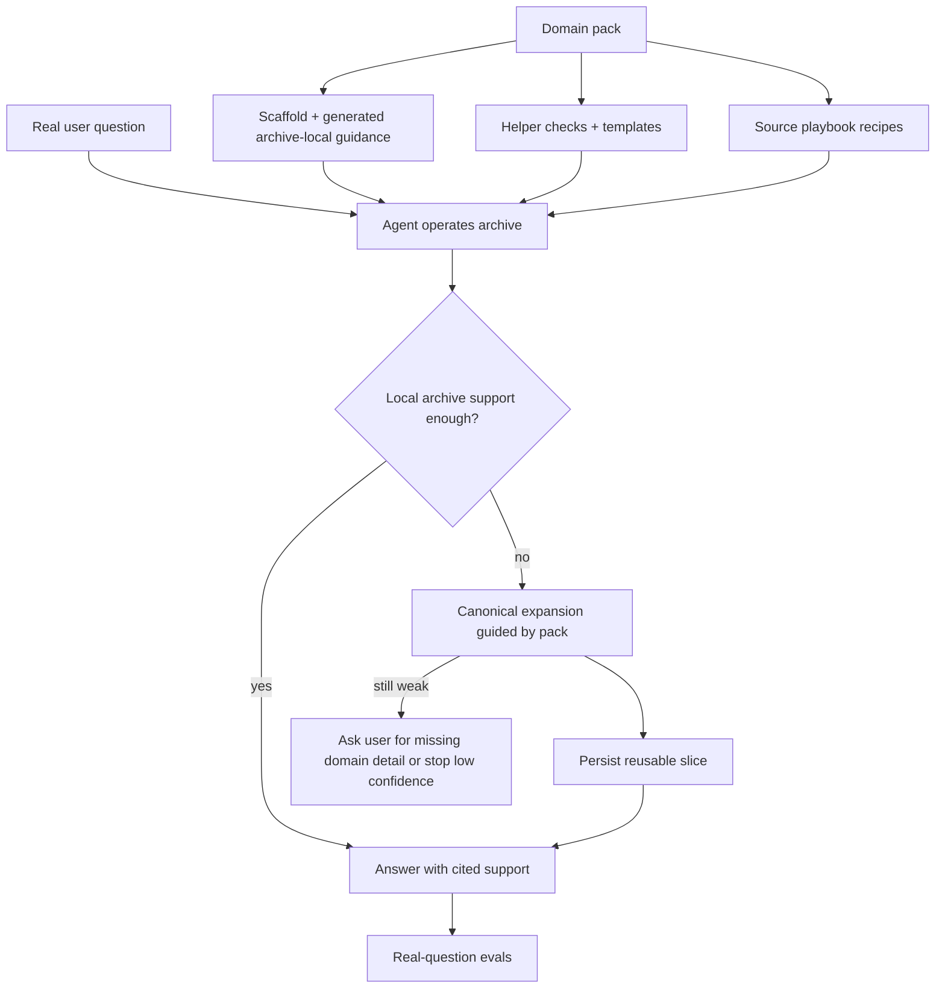

# feat: Agent-native self-growing archives

## Summary

Align Ledger with the strategy in [STRATEGY.md](STRATEGY.md): make it a meta system for agents to create and operate high-accuracy bounded archives from canonical sources. The product surface is not a heavyweight runtime. It is a domain-pack contract, generated archive-local operator guidance, small reusable helper checks and scripts, and evals that prove agents can answer real questions well while enriching the archive through use.

This document is the umbrella roadmap. Current execution for the reusable cross-index practice layer now lives in [docs/plans/2026-05-28-001-feat-meta-index-practices-plan.md](docs/plans/2026-05-28-001-feat-meta-index-practices-plan.md).

## Progress Snapshot

As of 2026-05-28, the repo is past the original `U1` through `U5` milestone and has completed the first live proof slice for the reusable meta-practices layer on the local `archive-index/`.

What is now working:

- Domain packs generate stronger archive-local operator surfaces, helper templates, and source playbooks.
- The live archive can distinguish `at_target`, `provisional`, and `below_target` answer states.
- Known weak slices and provisional weak slices can be recorded in `coverage-ledger.yaml` and detected through `check_coverage_state`.
- The live archive now enforces `auto_expand_when_below_target` for both known support gaps and provisional weak slices.
- Evals now include `expand_then_answer`, replay-style second-run proof, and false-completion guard metrics instead of only direct-answer and safety-block posture.
- A normal agent-style operator run works well for:
  - exact wording when a real extract exists
  - direct-answer replay on the resolved `article 43` slice
  - auto-expansion on known below-target `Código da Estrada` slices
  - likely-below-target detection on a provisional HPP reinvestment exception slice
  - fact-seeking case application with a natural `ask_user` path

What is still not solved:

- Unknown weak slices are not yet created automatically from ordinary archive use; they still need a real question plus manual eval or ledger registration to become durable memory.
- The repo still does not yet prove fully autonomous `expand -> persist -> answer` closure on a fresh real question path without manual setup.
- Cross-index transfer is still unproven on a second flagship domain.

This means the repo has moved from “promising toolkit” toward “reusable operator surface,” but the remaining work is now mostly about live archive compounding and content closure, not product philosophy.

---

## Problem Frame

The repo already has strong ingredients: scaffold generation, archive-local skills, verifier helpers, recipe files, and small evals. What it lacks is a tight contract that lets another agent reliably use those pieces to create, grow, query, and maintain an archive without bespoke corpus code or too much improvisation.

The old gap was misread as “missing runtime.” The sharper gap is different: Ledger does not yet define strongly enough what a domain pack must teach an agent, what helper surfaces should be generated with it, how question-driven enrichment decisions should be constrained, or how success should be judged on real question sets. That makes the current repo feel like a promising toolkit rather than a reusable meta system.

---

## Requirements

**Domain pack as product surface**

- R1. Ledger must define a strong domain-pack contract that is stronger than metadata and weaker than orchestration.
- R2. A domain pack must define what matters for archive configuration in its bounded domain, including source families, retrieval units, persistence posture, confidence posture, and refresh behavior.
- R3. A domain pack must define when the agent may autonomously gather more evidence and when it must ask the user for missing domain detail.
- R4. A domain pack must support multiple canonical source families within one bounded domain without forcing one pack per source family.
- R5. A domain pack must allow broad domain coverage while still permitting narrower subdomain packs where that improves quality or reuse.

**Generated operator surfaces**

- R6. Ledger must generate archive-local operator guidance from a domain pack so another agent can use the archive without repo archaeology.
- R7. Ledger must generate or connect helper checks and templates for important decisions such as persistence, confidence, refresh, and expansion.
- R8. Ledger must keep the hard reasoning with the agent while reducing undocumented improvisation during archive operation.

**Question-driven enrichment**

- R9. Ledger must treat real questions as enrichment triggers: answer locally when possible, expand from canonical sources when needed, persist what is worth reusing, and stop cleanly when confidence remains too low.
- R10. The expansion path must be constrained by the domain pack and helper surfaces rather than bespoke corpus-specific code in core.
- R11. Archive growth must stay incremental and question-driven; success must not depend on full upfront indexing of the corpus.

**Answer quality and proof**

- R12. Ledger success must be judged by answer quality on real question suites, not by scaffold completeness alone.
- R13. Evals must score groundedness, canonical support, and expansion success in ways that match the strategy metrics.
- R14. The first proving-ground archive must demonstrate that an agent using Ledger artifacts can answer a diverse set of real questions well.

---

## High-Level Technical Design

Ledger should stay layered, but with the agent at the center of operation:

The key design choice is that Ledger should compile archive-operating capability into the archive through packs, recipes, generated guidance, and helper surfaces. The agent remains the executor. Core code should stay small and reusable, mostly around scaffold generation, validation, and eval tooling.

---

## Key Technical Decisions

- KTD1. **Make the domain pack the real contract:** The main product boundary should be the pack schema and what it generates, not a generic runtime loop in core.
- KTD2. **Generate archive-local operator guidance by default:** Another agent should be able to open the archive and know how to operate it, what to persist, when to refresh, and when to ask the user.
- KTD3. **Use helper checks instead of orchestration code where possible:** Constrain important decisions with small scripts, validators, and templates rather than building a heavyweight controller.
- KTD4. **Introduce canonical source playbooks beneath domain packs:** Reusable source-shape recipes should capture common navigation and acquisition patterns without collapsing everything into corpus-specific code.
- KTD5. **Center proof on golden real-question suites:** The archive is only successful if agents using it answer real questions well, with support and low hallucination.

---

## Scope Boundaries

### In scope

- Domain-pack contract design and builder changes.
- Generated archive-local operator guidance and helper surfaces.
- Reusable source playbooks for canonical-source navigation patterns.
- Real-question evaluation improvements.
- One proving-ground archive that demonstrates the full Ledger approach.

### Deferred for later

- Pack inheritance/versioning across many repos.
- Rich end-user UI on top of archive operations.
- Broad support for weakly canonical or generic web-research domains.

### Outside this plan

- A heavyweight runtime or rigid orchestrator that replaces agent judgment.
- Full upfront ingestion of massive source universes.
- A legal-only product definition.

---

## System-Wide Impact

- The domain-pack builder becomes more central to the product.
- Archive-local skills and docs become more important than core orchestration code.
- Helper scripts and checks become first-class outputs, not incidental utilities.
- Evals become the main proof surface for Ledger quality.
- Example archives stop being mainly scaffold demos and start acting as product proofs.

---

## Risks & Dependencies

- Domain packs can become vague if the contract is too soft, recreating the current improvisation problem.
- Domain packs can become pseudo-runtimes if the contract is too heavy, recreating the runtime problem by another name.
- Source playbooks can become leaky abstractions if they are too generic to guide real navigation choices.
- Real-question evals require a sharper answer contract than current retrieval-oriented checks.
- The proving-ground archive can overfit the system if reusable pieces are not extracted deliberately.

---

## Implementation Units

### U1. Define the domain-pack contract

- **Goal:** Establish the product-level contract for what a domain pack must express about archive configuration, persistence, confidence, refresh, user escalation, and canonical-source use.
- **Requirements:** R1, R2, R3, R4, R5
- **Dependencies:** None
- **Files:** [skills/domain-archive-pack-builder/SKILL.md](skills/domain-archive-pack-builder/SKILL.md), [skills/domain-archive-pack-builder/scripts/scaffold_domain_pack.py](skills/domain-archive-pack-builder/scripts/scaffold_domain_pack.py), [README.md](README.md), [GETTING_STARTED.md](GETTING_STARTED.md)
- **Approach:** Replace the implicit “recipes + prose” expectation with a documented pack contract. Define the required sections and outputs a good pack must produce, including archive configuration hints, persistence rules, confidence posture, refresh policy, and escalation rules.
- **Patterns to follow:** Keep the strategy and the brainstorm doc aligned; preserve Ledger’s meta nature by specifying decision surfaces, not a central controller.
- **Test scenarios:**
  - A pack can describe a bounded domain with several canonical source families.
  - A pack can express autonomous evidence-gathering rules separately from ask-user triggers.
  - A pack can express confidence and refresh expectations in a way another agent can actually use.
  - Builder docs make clear what belongs in the pack versus helper surfaces.
- **Verification:** A domain expert can create a pack that another agent can operate without inventing its own archive policy from scratch.

### U2. Generate archive-local operator guidance and helper surfaces

- **Goal:** Ensure each archive scaffold comes with practical, local operating guidance plus helper checks for the most important archive decisions.
- **Requirements:** R6, R7, R8
- **Dependencies:** U1
- **Files:** [skills/domain-archive-pack-builder/scripts/scaffold_domain_pack.py](skills/domain-archive-pack-builder/scripts/scaffold_domain_pack.py), [skills/archive-index-builder/SKILL.md](skills/archive-index-builder/SKILL.md), generated `archive-index/AGENTS.md`, generated `archive-index/recipes/`, generated `archive-index/scripts/`, generated `archive-index/domain/`
- **Approach:** Strengthen scaffold outputs so a new archive includes operator instructions, decision templates, and helper checks for persistence, confidence, and refresh. These should guide another agent locally, not just document theory.
- **Patterns to follow:** Reuse the existing archive-local structure instead of inventing a new control plane.
- **Test scenarios:**
  - A scaffolded archive contains clear local guidance for query, expansion, persistence, and refresh.
  - Helper checks exist for at least support/confidence, persistence decisions, and refresh rules.
  - Another agent can operate the archive with local files alone.
  - The generated outputs remain small and editable.
- **Verification:** A fresh archive feels operable by another agent, not like a blank shell that still requires repo archaeology.

### U3. Introduce canonical source playbooks

- **Goal:** Add reusable source-shape recipes that help packs express how canonical systems should be navigated and enriched without writing bespoke code for each corpus.
- **Requirements:** R2, R4, R9, R10, R11
- **Dependencies:** U1
- **Files:** new playbook layer under [skills/domain-archive-pack-builder/](skills/domain-archive-pack-builder/), [archive-index/recipes/source-families.yaml](archive-index/recipes/source-families.yaml), [archive-index/recipes/source-acquisition.yaml](archive-index/recipes/source-acquisition.yaml), [archive-index/recipes/extract-units.yaml](archive-index/recipes/extract-units.yaml)
- **Approach:** Define reusable playbook shapes for common canonical systems such as legal gazettes, consolidated views, official guidance portals, annual tables, or official registries. Let packs compose these playbooks instead of re-describing source-navigation behavior from scratch.
- **Patterns to follow:** Keep playbooks declarative and recipe-like; do not let them become mini runtimes.
- **Test scenarios:**
  - Two different packs can reuse the same playbook shape with different source specifics.
  - A playbook can guide source-family choice, retrieval-unit choice, and persistence posture.
  - Playbook outputs remain understandable to agents reading local archive files.
  - Adding a new playbook does not require changing core Ledger code.
- **Verification:** Common canonical-source behavior becomes easier to reuse across archives without collapsing into bespoke parser-heavy implementations.

### U4. Define the question-driven enrichment operator protocol

- **Goal:** Make the archive operation loop explicit as a protocol the agent follows using the pack, local guidance, and helper checks.
- **Requirements:** R3, R7, R8, R9, R10, R11
- **Dependencies:** U1, U2, U3
- **Files:** [skills/archive-index-builder/SKILL.md](skills/archive-index-builder/SKILL.md), generated `archive-index/AGENTS.md`, generated helper scripts under `archive-index/scripts/`, verifier-related docs/scripts
- **Approach:** Write down and scaffold the practical loop: classify question, check local support, decide whether in-bounds expansion is allowed, choose canonical path, persist reusable slice, reassess confidence, answer or ask the user for missing domain detail. Keep this as guidance + checks, not orchestrator code.
- **Execution note:** The protocol should be easy for another agent to follow from local files and helper outputs.
- **Patterns to follow:** Preserve the archive-first rule already documented in the repo and make it operational rather than merely aspirational.
- **Test scenarios:**
  - In-bounds missing-local-support questions trigger autonomous evidence gathering.
  - Missing-user-facts questions ask the user instead of continuing retrieval blindly.
  - Low-confidence situations stop or hedge according to pack policy.
  - Useful discovered material is persisted for future reuse.
- **Verification:** Another agent can follow the protocol consistently without a hidden runtime layer doing the real work.

### U5. Rebuild evals around golden real-question suites

- **Goal:** Make answer quality on real question sets the main proof that Ledger works.
- **Requirements:** R12, R13, R14
- **Dependencies:** U2, U4
- **Files:** [skills/archive-evals/SKILL.md](skills/archive-evals/SKILL.md), [skills/archive-evals/scripts/run_archive_evals.py](skills/archive-evals/scripts/run_archive_evals.py), scenario docs under [skills/archive-evals/references/](skills/archive-evals/references/), archive-local eval scenarios
- **Approach:** Shift eval emphasis from fixture retrieval to real questions with expectations around grounding, canonical support, and expansion success. Keep retrieval metrics as diagnostics, not the main success contract.
- **Patterns to follow:** Use the strategy metrics directly: reliability rate, canonical support rate, and expansion success rate.
- **Test scenarios:**
  - A locally answerable real question passes with strong support.
  - A question that needs expansion passes only if the right canonical slice is found and persisted.
  - A low-confidence or missing-facts case is scored correctly as unresolved or provisional.
  - Reports distinguish answer quality from retrieval quality.
- **Verification:** Eval output answers “can an agent using this archive answer real questions well?” rather than only “did the archive retrieve the expected artifact?”

### U6. Prove the system on one flagship archive, then extract the reusable pieces

- **Goal:** Use one strong archive as the proving ground for Ledger’s meta-system, then extract what generalizes back into packs, playbooks, and helpers.
- **Requirements:** R9, R11, R14
- **Dependencies:** U1, U2, U3, U4, U5
- **Files:** local `archive-index/` workspace, generated archive-local guidance, archive-local eval scenarios, [examples/README.md](examples/README.md)
- **Approach:** Pick the repo’s strongest archive, harden it until another agent can operate it well, and use that experience to refine the generic Ledger surfaces. Treat this archive as a proving ground, not the product boundary.
- **Patterns to follow:** Extract only what truly generalizes; leave domain-specific details inside the pack.
- **Test scenarios:**
  - A diverse real-question suite includes local hits, canonical-expansion hits, refresh-sensitive cases, and low-confidence cases.
  - Another agent can operate the archive from its local guidance and helper surfaces.
  - Improvements discovered in the flagship archive can be pulled back into generic Ledger pack/playbook/helper design.
  - The archive proves the meta-system without forcing Ledger into a legal-only identity.
- **Verification:** The repo has one concrete archive that convincingly demonstrates the Ledger strategy and produces reusable learnings for other domains.

---

## Open Questions

- What is the minimum domain-pack contract that is strong enough to reduce improvisation without turning into orchestration?
- Which canonical-source playbook families deserve first-class treatment first?
- What exact answer contract should evals enforce across domains versus leaving pack-specific?
- Which current archive should be the flagship proving ground for extraction?

---

## Sources / Research

- [STRATEGY.md](STRATEGY.md) defines the target problem, approach, user, metrics, and tracks.
- [docs/brainstorms/2026-05-27-domain-pack-product-surface-requirements.md](docs/brainstorms/2026-05-27-domain-pack-product-surface-requirements.md) defines the domain-pack product surface and its requirements.
- [skills/archive-index-builder/SKILL.md](skills/archive-index-builder/SKILL.md) captures the archive-first philosophy and question-driven enrichment posture already present in the repo.
- [skills/domain-archive-pack-builder/SKILL.md](skills/domain-archive-pack-builder/SKILL.md) is the current builder surface that should become more central under this plan.
- Current `archive-index/` structure shows the right generated-local shape, but still needs stronger operator-facing guidance and reusable decision surfaces.
