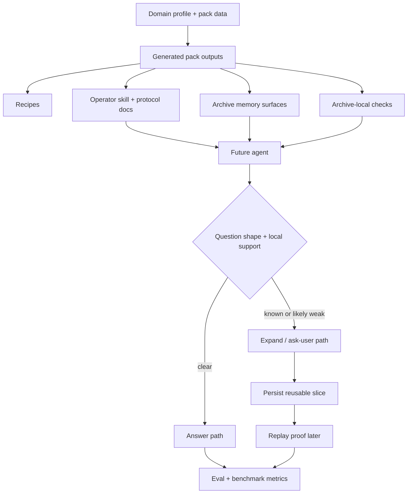

# feat: Standardize cross-index meta practices

## Summary

Turn Ledger's archive vision into a reusable cross-index operating contract: every index should generate the same core pack surfaces, remember the same kinds of weakness and freshness state, expose the same decision checks, and prove progress with the same eval families. The goal is to make a new index require new pack data and, at most, a new source playbook, not a new theory of operation.

This is the current execution plan for the reusable meta-practices layer under the umbrella roadmap in [docs/plans/2026-05-27-001-feat-self-growing-canonical-archives-plan.md](/Users/alexandre/dev/parliament/docs/plans/2026-05-27-001-feat-self-growing-canonical-archives-plan.md).

## Progress Snapshot

As of 2026-05-28, `U1` through `U5` are materially implemented on the first flagship archive proof slice.

What is now working:

- Generated pack references, docs, and scaffolds define the reusable cross-index practice layer explicitly.
- Generated archive memory now includes `provisional_weak_slices` alongside `support_gaps`, `partial_topics`, and `stale_topics`.
- The shared archive check helper distinguishes `clear`, `known_below_target`, and `likely_below_target`.
- Archive eval summaries now expose `replay_metrics` and `false_completion_metrics`.
- The live flagship archive now proves:
  - one replay-style direct-answer slice
  - two false-completion guard slices
  - one provisional weak-slice path with `likely_below_target`

What remains after this first proof slice:

- automatic creation of provisional weak-slice memory from ordinary runs
- automatic confirmation, clearing, or superseding of provisional weak slices after later enrichment
- a fresh real-question proof of autonomous `expand -> persist -> answer`
- transfer proof on a second domain

These remaining items are now the next frontier, not contract or eval scaffolding.

---

## Problem Frame

The repo already proves that Ledger can scaffold a bounded archive, generate a useful domain pack, and enforce some important decisions on a live archive. The current flagship archive rebuilds cleanly at `165` documents and `100` links, its archive-eval suite is `7/7` green, its answer-quality surface shows `5` `direct_answer` cases and `2` `expand_then_answer` cases, and it now reports `replay_metrics.second_run_local_hit_rate = 1.0` plus `false_completion_metrics.guard_success_rate = 1.0`. That is real progress, but it is still proof of a first flagship slice rather than full operational compounding across ordinary runs and multiple domains.

What is still missing is a standard practice layer that makes this behavior portable across index types. Right now Ledger has strong pieces:

- domain packs that are stronger than metadata and weaker than orchestration
- generated archive-local operator skills and helper templates
- coverage-ledger support for known `support_gaps`
- archive evals with retrieval, answer-quality, and trajectory metrics

What it did not yet have when this plan started was a full cross-index contract for:

- how every index should remember provisional weakness, known gaps, and stale slices
- how every index should run the same pre-answer judgment points before claiming local sufficiency
- how every index should prove compounding improvement after `expand -> persist -> answer`
- how every index should test false completion, not only green direct hits

That gap mattered because Ledger's stated product is a meta, agent-native archive kit. The first implementation pass closed much of that contract gap; the remaining gap is now operational compounding, not whether the practice layer exists at all.

---

## Requirements

**Cross-index pack contract**

- R1. Ledger must standardize the minimum cross-index pack outputs that every bounded archive should generate, extending the existing domain-pack contract rather than replacing it (see origin: `docs/brainstorms/2026-05-27-domain-pack-product-surface-requirements.md`).
- R2. Every index must express question-shape support targets, answer-quality posture, and escalation rules through generated pack surfaces rather than archive-specific prose improvisation.
- R3. Every index must be able to add new source families or a new source playbook without requiring a new core theory of archive operation.

**Cross-index archive memory**

- R4. Every generated archive must carry a standardized self-knowledge surface for known support gaps, provisional weak slices, stale slices, and partial coverage.
- R5. The archive memory surface must distinguish suspicion from confirmed weakness so the archive can compound self-knowledge without pretending every discovered gap is already curated.
- R6. The generated operator guidance must explain how those memory states are created, cleared, confirmed, or superseded.

**Cross-index operator checks**

- R7. Every generated archive must expose the same judgment points before and after answer commitment: coverage state, support hierarchy, pre-answer weak-slice assessment, auto-expand enforcement, and confirmation boundary.
- R8. These checks must stay helper-sized and archive-local, preserving the strategy of packs plus checks rather than introducing a heavyweight runtime.
- R9. The generated operator skill and protocol docs must make those checks part of the normal archive loop for future agents.

**Cross-index proof and metrics**

- R10. Every generated archive must prove direct-answer, expand-then-answer, ask-user, and false-completion boundaries through a standard eval family shape.
- R11. Ledger must add a replay-style proof surface that measures whether a first-run gap becomes a stronger local hit on a later run.
- R12. The benchmark/reporting surface must expose product-grade metrics that distinguish answer correctness from compounding behavior, including at least one replay metric and one false-completion metric.

**Flagship proof**

- R13. The current flagship archive must be the first live proof of the standardized practice layer before the repo asks a second domain to validate transfer.
- R14. The plan must improve the reusable meta layer in repo code and generated outputs, not only patch the current archive locally.

---

## High-Level Technical Design

Ledger should standardize a small set of reusable layers that every index gets:

The design rule is:

- Ledger core owns reusable structure, deterministic generation, validation, and proof surfaces.
- The pack owns domain-specific policy and source-family selection.
- The playbook owns generic source-shape behavior.
- The live archive owns local generated state and real content.

This keeps the system meta and recipe-first while still raising the floor for future agents.

---

## Key Technical Decisions

- KTD1. **Treat cross-index practice as generated contract, not team folklore:** The reusable layer should live in generated pack outputs, operator docs, templates, and checks rather than in convention-only docs.
- KTD2. **Add new memory states before adding new orchestration:** Provisional weak slices, partial topics, and stale topics are the right next primitives because they let the archive remember what it learned without inventing a runtime controller.
- KTD3. **Standardize judgment points, not archive-specific actions:** `check_coverage_state`, support hierarchy, pre-answer weak-slice assessment, and confirmation boundary should be the shared contract; exact source navigation remains archive-local and playbook-driven.
- KTD4. **Promote replay and false-completion to first-class proof surfaces:** Current retrieval and answer-quality metrics are necessary but not sufficient to prove compounding archive behavior.
- KTD5. **Use the flagship archive as proof, not as product definition:** The first live implementation should land on the current legal/tax archive, but the reusable practice layer must remain generic across future index types.

---

## Scope Boundaries

### In scope

- Domain-pack contract and generated-output changes needed to standardize cross-index practice.
- Archive-local helper and memory-surface changes that future generated archives will receive by default.
- Eval, benchmark, and reporting changes needed to prove replay improvement and false-completion boundaries.
- One live proof on the current flagship archive and one committed example-benchmark proof where appropriate.

### Deferred to Follow-Up Work

- Standing up a second non-legal flagship archive to test cross-domain transfer after the reusable practice layer lands.
- Rich archive-growth economics instrumentation beyond the first replay and false-completion metrics.
- Additional non-legal source-playbook families that are not needed to prove the reusable contract.

### Deferred for later

- Pack inheritance and versioning across many repos.
- UI surfaces for non-expert archive operators.
- Broader weakly canonical web-research domains.

### Outside this product's identity

- A heavyweight runtime or controller that replaces archive-local skills and helper checks.
- Full upfront ingestion of complete canonical source universes.
- Archive-specific core modules that hardcode crawler logic for each source family.

---

## System-Wide Impact

- The generated pack becomes the main reuse boundary for future index types.
- The coverage ledger stops being only a known-gap list and becomes a fuller self-knowledge surface.
- The archive check helper becomes more central to the operator loop because future agents will use it as the shared pre-answer judgment contract.
- The eval layer becomes more obviously product-facing: not just "did it answer?" but "did it learn and did it avoid false completion?"
- README and getting-started surfaces will need to explain Ledger as a meta index-creation and index-operation toolkit rather than only an archive scaffold tool.

---

## Risks & Dependencies

- If the new practice layer is too abstract, it will restate strategy without changing behavior.
- If it is too specific to legal/statutory archives, it will overfit the flagship archive and weaken transfer.
- If replay metrics are underspecified, the repo may report compounding without actually proving second-run improvement.
- If provisional memory semantics are vague, future agents may accumulate noisy archive state or fail to clear stale suspicion.
- This work depends on keeping generated outputs small and inspectable; otherwise the pack layer becomes hard to reason about and hard to evolve.

---

## Success Metrics

Use the current flagship archive as the baseline and measure deltas after implementation:

- `answer_quality_metrics.pass_rate` stays at or above the current `1.0`.
- `trajectory_metrics.drift_rate` stays at or below the current `0.0`.
- `answer_quality_metrics.response_modes.expand_then_answer` stays at or above the current `2` scenarios while replay and weak-slice proof remain active.
- `replay_metrics.second_run_local_hit_rate` is present, non-null, and currently at `1.0` on the flagship archive.
- `false_completion_metrics.false_completion_rate` is present and currently at `0.0` on the flagship archive.
- Generated archives include standardized memory surfaces for provisional weakness in addition to known support gaps.
- Follow-on work should add an automatic weak-slice-registration metric once ordinary-run persistence exists.

---

## Sources / Research

- `STRATEGY.md`
- `PRINCIPLES.md`
- `README.md`
- `GETTING_STARTED.md`
- `skills/domain-archive-pack-builder/SKILL.md`
- `skills/domain-archive-pack-builder/references/domain-pack-contract.md`
- `skills/domain-archive-pack-builder/references/source-playbooks.md`
- `docs/brainstorms/2026-05-27-domain-pack-product-surface-requirements.md`
- `docs/ideation/2026-05-28-ledger-strategy-gaps-ideation.md`
- `docs/plans/2026-05-27-001-feat-self-growing-canonical-archives-plan.md`

---

## Implementation Units

### U1. Extend the generated cross-index contract

- **Goal:** Make the domain-pack contract and generated-output references explicitly define the reusable cross-index practice layer every archive should receive.
- **Requirements:** R1, R2, R3, R6, R8, R14
- **Dependencies:** None
- **Files:** `skills/domain-archive-pack-builder/SKILL.md`, `skills/domain-archive-pack-builder/references/domain-pack-contract.md`, `skills/domain-archive-pack-builder/references/generated-pack-outputs.md`, `skills/domain-archive-pack-builder/references/operator-skill-contract.md`, `skills/domain-archive-pack-builder/references/source-playbooks.md`, `README.md`, `GETTING_STARTED.md`, `PRINCIPLES.md`
- **Approach:** Tighten the contract at the reference layer first. Define the mandatory generated practices explicitly: standardized memory states, mandatory judgment points, and proof families every archive should expose. Keep the existing "stronger than metadata, weaker than orchestration" boundary intact.
- **Patterns to follow:** Reuse the existing contract/reference style already used by the domain-pack builder and keep the repo recipe-first.
- **Test scenarios:**
  - Contract docs distinguish pack policy, playbook behavior, archive-local memory, and helper checks without overlap.
  - A reader can tell what every new generated archive must expose before reading live archive examples.
  - The docs still reject source-specific core logic and heavyweight orchestration.
- **Verification:** Another implementer can read the references and know what reusable practices must exist for any new index type.

### U2. Standardize generated archive memory surfaces

- **Goal:** Update generated pack outputs so every archive gets the same self-knowledge surface for confirmed gaps, provisional weakness, partial coverage, and stale slices.
- **Requirements:** R4, R5, R6, R14
- **Dependencies:** U1
- **Files:** `skills/domain-archive-pack-builder/scripts/scaffold_domain_pack.py`, `skills/domain-archive-pack-builder/scripts/validate_domain_pack.py`, `tests/unit/test_domain_archive_pack_builder.py`, `domain/coverage-ledger.yaml` generated output shape
- **Approach:** Extend the coverage-ledger scaffold and validator so provisional weak slices become a first-class generated concept instead of an archive-local convention. Clarify transition semantics in generated notes: suspected, confirmed, cleared, superseded.
- **Patterns to follow:** Mirror the existing `support_gaps`, `partial_topics`, and `stale_topics` structure rather than inventing a separate storage model.
- **Test scenarios:**
  - Freshly scaffolded archives include the new standardized memory fields and notes.
  - Validation fails when generated memory fields are missing or malformed.
  - Generated notes distinguish provisional suspicion from confirmed support gaps.
- **Verification:** A freshly scaffolded archive exposes the full cross-index self-knowledge surface without hand edits.

### U3. Add the shared pre-answer judgment contract

- **Goal:** Standardize the archive-local decision checks every generated archive uses before claiming local support is sufficient.
- **Requirements:** R7, R8, R9, R14
- **Dependencies:** U1, U2
- **Files:** `skills/archive-index-builder/scripts/scaffold_archive_index.py`, `skills/domain-archive-pack-builder/scripts/scaffold_domain_pack.py`, `tests/unit/test_archive_run_archive_check.py`, `tests/unit/test_domain_archive_pack_builder.py`, generated `domain/OPERATIONS.md`, generated `domain/ENRICHMENT_PROTOCOL.md`, generated `skills/<domain-slug>-operator/SKILL.md`
- **Approach:** Extend the shared helper and generated docs so the normal operator loop explicitly includes pre-answer weak-slice assessment alongside the existing coverage-state, support-hierarchy, auto-expand, and confirmation checks. Keep this helper-sized and archive-local so it remains pack-driven rather than runtime-driven.
- **Execution note:** Start from characterization coverage in `tests/unit/test_archive_run_archive_check.py` before changing helper outputs.
- **Patterns to follow:** Match the existing `check_coverage_state` and `check_auto_expand_decision` style; generated docs should continue to point future agents at `uv run python scripts/run_archive_check.py ...`.
- **Test scenarios:**
  - A known support gap still blocks direct answer and suggests `expand`.
  - A provisional weak slice can be represented distinctly from a known support gap.
  - Generated operator docs tell a future agent when to run the new judgment check and how it relates to existing checks.
  - Non-weak local support still returns a clear path without forcing expansion.
- **Verification:** Generated archives have one obvious shared pre-answer judgment contract rather than several loosely related helper concepts.

### U4. Add replay and false-completion proof families

- **Goal:** Make Ledger's proof surface measure compounding behavior and false completion, not only direct green answers.
- **Requirements:** R10, R11, R12
- **Dependencies:** U1, U3
- **Files:** `skills/archive-evals/scripts/run_archive_evals.py`, `skills/domain-archive-pack-builder/scripts/benchmark_domain_pack.py`, `skills/domain-archive-pack-builder/scripts/scaffold_domain_pack.py`, `tests/unit/test_domain_archive_pack_benchmark.py`, `tests/unit/test_archive_examples.py`, generated `archive-evals/thresholds.json`, generated `domain-benchmarks/thresholds.json`
- **Approach:** Add standard eval/benchmark taxonomy for replay-style closure and exception-sensitive false-completion cases. Extend generated thresholds so new archives get a starter proof posture for these families, even if the first archive supplies the first strong live scenarios.
- **Patterns to follow:** Reuse the existing archive-evals summary/threshold model and benchmark-domain-pack family-score structure instead of inventing a second metrics pipeline.
- **Test scenarios:**
  - Eval summaries expose a replay metric and a false-completion metric when scenarios are present.
  - Generated thresholds include starter sections for those metrics without breaking existing archives.
  - Benchmark output can compare baseline vs packed behavior without harming current archive clean-pass rate expectations.
  - Existing example summaries continue to render and threshold correctly after the new metrics are added.
- **Verification:** Ledger can report not just correctness but whether an archive learned and whether it avoided premature completion.

### U5. Prove the reusable practice layer on the flagship archive

- **Goal:** Demonstrate the standardized practice layer on the current flagship archive before asking a second domain to prove transfer.
- **Requirements:** R10, R11, R13, R14
- **Dependencies:** U2, U3, U4
- **Files:** `archive-index/` local workspace, `archive-index/domain/coverage-ledger.yaml`, `archive-index/archive-evals/scenarios/*.json`, `archive-index/archive-evals/thresholds.json`, `examples/benchmark-summary.md`
- **Approach:** Add at least one live provisional-weakness path, one replay-style closure path, and one false-completion/exception-completeness path to the flagship archive proof surface. The key output is not just a green run; it is proof that the reusable contract changed real archive behavior on the live workspace.
- **Execution note:** Use the repo's archive proof ladder: repo tests, archive evals, and at least one real agent-style trial against the live archive.
- **Patterns to follow:** Reuse the current live archive as the proving ground rather than spinning up a new domain too early.
- **Test scenarios:**
  - A real known-gap path still behaves correctly after the new reusable practice layer lands.
  - A replay scenario proves that after a first-run gap is closed, a later run can hit stronger local support.
  - An exception-sensitive scenario proves the archive avoids false completion on incomplete local support.
  - Existing clean direct-answer scenarios continue to pass.
- **Verification:** The live archive shows the new cross-index practices in action rather than only in generated docs and scaffold tests.

### U6. Refresh the public Ledger narrative around meta index practices

- **Goal:** Align the public repo narrative with the new reusable practice layer so Ledger is legible as a meta index-creation and index-operation toolkit.
- **Requirements:** R1, R2, R10, R12
- **Dependencies:** U1, U4, U5
- **Files:** `README.md`, `GETTING_STARTED.md`, `examples/benchmark-summary.md`
- **Approach:** Update the repo-facing docs to explain the standardized practice layer: what every archive generates, what every operator checks, what every archive remembers, and what every archive must prove. Keep the story concise and anchored in the metrics/reporting surface rather than strategy slogans.
- **Patterns to follow:** Match the repo's current concise documentation style and keep examples grounded in existing Ledger surfaces.
- **Test scenarios:** Test expectation: none -- documentation-only unit, but the narrative must remain consistent with the generated contract and live proof surfaces.
- **Verification:** A new reader can understand how Ledger generalizes across index types without reading deep implementation code first.

---

## Open Questions

- Which exact field names should represent provisional weak slices in the generated coverage ledger so they remain compact but still distinct from confirmed gaps?
- Should replay proof live entirely inside `archive-evals`, or should `benchmark_domain_pack.py` own the first cross-run aggregation layer and feed it back into eval summaries?
- Which first flagship false-completion scenario best exercises the generic contract without overfitting it to legal/statutory language?
