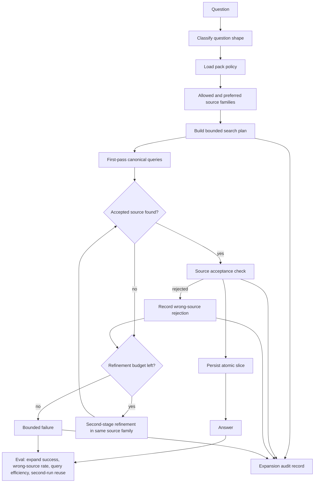

# feat: Add bounded canonical expansion

## Summary

Add a reusable bounded-canonical-expansion contract to Ledger so operators choose the right canonical source family from pack policy, search it with a small bounded query plan, reject wrong-source drift, and stop safely after one refinement loop instead of widening silently.

This plan uses the brainstorm in `docs/brainstorms/2026-05-28-bounded-canonical-expansion-requirements.md` as the source of truth for product behavior and proof shape.

---

## Problem Frame

Ledger already has archive-first expansion, domain-pack generation, and helper-sized archive checks. What it still lacks is a reusable discipline for how an operator should expand once local coverage is weak. Today the system can drift to the wrong official layer, issue weak or repetitive queries on the right source, or broaden implicitly instead of failing boundedly.

That gap is now product-critical because expansion reliability is part of Ledger's core claim: archives should grow from canonical sources in an agent-native, bounded, and auditable way. The missing layer is not another runtime. It is a stronger contract spanning pack policy, operator checks, and eval proof.

---

## Requirements

**Source-family policy**

- R1. Ledger must support a reusable bounded-canonical-expansion contract across canonical source systems.
- R2. The contract must map question shape to allowed source families before expansion widens.
- R3. The contract must distinguish allowed and preferred source families.
- R4. Operators must not expand on source families that are not allowed for the current question shape.

**Question-shape and search planning**

- R5. The first version must support a minimum reusable question-shape taxonomy strong enough to drive source-family policy.
- R6. Source-family policy must live at question-shape level in the pack.
- R7. Operators must determine question shape before selecting a search plan.
- R8. Packs must define reusable canonical search guidance for relevant source families and question shapes.
- R9. Operators must emit a bounded search plan with target source family and small query budget.
- R10. The first version must improve query discipline on the correct canonical source family, not only block wrong-source expansion.
- R11. Operators may perform one bounded second-stage refinement inside the same allowed source family when the first pass is weak.
- R12. Operators must not broaden from a canonical source family to general official-source exploration unless the pack explicitly permits that fallback.

**Source acceptance and bounded stopping**

- R13. Ledger must apply a source acceptance check before using a found page for expansion or persistence.
- R14. Source acceptance must reject pages outside the allowed source-family policy for the current question shape.
- R15. Operators must stop after the configured search and refinement budget instead of continuing open-ended search.
- R16. When bounded search fails, operators must return a bounded failure posture instead of silently substituting another source family.

**Persistence and auditability**

- R17. Packs must define the persistence unit expected for each source family in scope.
- R18. Operators must record an expansion audit trail explaining why expansion was allowed, which source family was chosen, what search stage ran, and why the accepted source passed policy.
- R19. The audit trail must also explain bounded failure when no acceptable canonical support is found.

**Evaluation**

- R20. Ledger evals must measure wrong-source drift as a first-class failure mode.
- R21. Ledger evals must measure first-run expand success under bounded canonical expansion.
- R22. Ledger evals must separately surface query-efficiency failures within the correct source family.
- R23. The first version must prove improvement on real benchmarks not biased toward the archive's current local coverage.

---

## Key Technical Decisions

- KTD1. **Extend the existing pack/check shape instead of adding a new controller:** bounded canonical expansion should plug into current pack recipes, generated operator docs, and archive-local checks rather than create a separate runtime path.
- KTD2. **Make the pack the primary home for stable search discipline:** allowed source families, preferred source families, question-shape policy, search templates, and persistence units should be generated pack data first and operator memory second.
- KTD3. **Treat wrong-source prevention as the first optimization target:** bounded failure on the right source family is better than a plausible answer from the wrong one.
- KTD4. **Limit search refinement to one extra stage in v1:** this is enough to improve weak first-pass queries without creating a vague open-ended exploration loop.
- KTD5. **Use benchmark pressure instead of local-coverage-friendly proof:** the flagship proof should lean on the new DR-only and edge-case benchmark sets so the feature is tested against hard, unfamiliar slices.

---

## High-Level Technical Design

The design rule is:

- packs define the policy and search discipline,
- operators execute that policy through a bounded search loop,
- archive-local checks enforce acceptance and stopping,
- evals prove both success and bounded failure.

---

## Scope Boundaries

### In scope

- Domain-pack schema, references, scaffolds, and validation changes needed to express bounded canonical expansion.
- Archive-local helper and generated operator-surface changes needed to execute bounded search plans and source acceptance checks.
- Eval-schema, reporting, and benchmark updates needed to measure wrong-source drift, query-efficiency failures, and first-run expand success.
- One live flagship proof on the current archive using DR-only benchmark pressure.

### Deferred to Follow-Up Work

- Broader fallback policies that widen from canonical source family to other official-source families.
- Rich operator memory that learns search heuristics primarily from prior runs.
- More sophisticated multi-stage search optimization beyond one bounded refinement loop.

### Deferred for later

- Cross-pack inheritance/versioning for source-family policies across many repos.
- UI surfaces for non-expert pack authors.
- Weakly canonical or mixed-source web research domains.

### Outside this product's identity

- Generic web search as the default archive-growth strategy.
- Implicit source-family policy hidden in prompts or operator intuition.
- A heavyweight runtime that replaces archive-local skills and checks.

---

## System-Wide Impact

- Domain packs become more operationally meaningful: they stop at source-family policy and search discipline, not just support and persistence rules.
- Archive-local operator guides become more explicit about how expansion happens, not only when expansion is required.
- `check_expansion_plan` and adjacent checks become more central to the answer path because they mediate source-family choice, search acceptance, and stopping.
- Eval reporting becomes more product-facing by separating wrong-source drift from on-source inefficiency and from overall expand success.
- The repo's benchmark philosophy shifts further toward expand-mode proof rather than archive-only coverage diagnostics.

---

## Risks & Dependencies

- If the v1 question-shape taxonomy is too narrow, the contract will overfit legal-rule lookup and weaken transfer.
- If the pack schema becomes too elaborate, source-family policy could start resembling a hidden mini-runtime.
- If source acceptance is too permissive, wrong-source drift will survive under a new name.
- If bounded failure is not surfaced clearly, operators may still widen implicitly or appear flaky to maintainers.
- This work depends on keeping the benchmark sets intentionally unfriendly to current local coverage so reported gains mean something.

---

## Acceptance Examples

- AE1. A legal-rule question with DR-only policy expands only within the DR source family even when an easier official FAQ is available.
- AE2. A weak first-pass query on the correct source family gets one bounded refinement pass rather than a long trail of low-value searches.
- AE3. A plausible page from a non-allowed source family is rejected and logged instead of being used to settle the answer.
- AE4. When the allowed source family still fails within budget, the operator stops boundedly and records why.
- AE5. Eval reports distinguish wrong-source drift, query-efficiency failures, and first-run expand success on benchmark sets biased away from current archive coverage.

---

## Sources / Research

- `STRATEGY.md`
- `docs/brainstorms/2026-05-28-bounded-canonical-expansion-requirements.md`
- `docs/brainstorms/2026-05-27-unknown-weak-slice-pre-answer-detection-requirements.md`
- `docs/plans/2026-05-28-001-feat-meta-index-practices-plan.md`
- `docs/evals/2026-05-28-dr-only-portuguese-legal-benchmark.md`
- `docs/evals/2026-05-28-dr-only-edge-case-portuguese-legal-benchmark.md`
- `skills/domain-archive-pack-builder/references/expansion-recipes.md`
- `skills/domain-archive-pack-builder/scripts/check_expansion_plan.py`
- `skills/domain-archive-pack-builder/scripts/scaffold_domain_pack.py`
- `skills/archive-index-builder/scripts/scaffold_archive_index.py`
- `skills/archive-evals/SKILL.md`
- `skills/archive-evals/references/buckets-and-reporting.md`
- `skills/archive-evals/references/scenario-schema.md`
- `tests/unit/test_domain_archive_pack_builder.py`
- `tests/unit/test_archive_evals_reporting.py`

---

## Implementation Units

### U1. Extend the pack contract for bounded canonical expansion

- **Goal:** Teach generated packs to declare question-shape source policy, canonical search guidance, and persistence-unit expectations as first-class reusable outputs.
- **Requirements:** R1, R2, R3, R5, R6, R8, R17
- **Dependencies:** None
- **Files:** `skills/domain-archive-pack-builder/references/domain-pack-contract.md`, `skills/domain-archive-pack-builder/references/generated-pack-outputs.md`, `skills/domain-archive-pack-builder/references/expansion-recipes.md`, `skills/domain-archive-pack-builder/SKILL.md`, `skills/domain-archive-pack-builder/scripts/scaffold_domain_pack.py`, `skills/domain-archive-pack-builder/scripts/validate_domain_pack.py`, `tests/unit/test_domain_archive_pack_builder.py`
- **Approach:** Extend the generated recipe surface rather than adding a sidecar policy file. The new contract should let packs express a minimum reusable question-shape taxonomy, allowed/preferred source families per shape, bounded search templates, and persistence-unit expectations in the same editable recipe family operators already use.
- **Patterns to follow:** Follow the current generated recipe model in `scaffold_domain_pack.py`, especially the existing `source-acquisition.yaml`, `extract-units.yaml`, and `answer-contract.yaml` generation pattern.
- **Test scenarios:**
  - A freshly scaffolded pack includes question-shape-aware source policy and search guidance in generated recipe outputs.
  - Validation fails when a pack omits required source-family policy for a declared question shape.
  - Validation fails when preferred source families are not members of the allowed set.
  - Generated operator-facing docs mention the new pack outputs without conflicting with existing acquisition and persistence guidance.
- **Verification:** A new archive scaffold can express source-family policy and bounded search discipline entirely through generated pack artifacts.

### U2. Add bounded search planning and source acceptance to archive-local checks

- **Goal:** Make archive-local operator checks enforce source-family choice, bounded refinement, source acceptance, and bounded failure instead of only validating expansion payload shape.
- **Requirements:** R4, R7, R9, R10, R11, R12, R13, R14, R15, R16, R18, R19
- **Dependencies:** U1
- **Files:** `skills/archive-index-builder/scripts/scaffold_archive_index.py`, `skills/domain-archive-pack-builder/scripts/check_expansion_plan.py`, `skills/domain-archive-pack-builder/scripts/scaffold_domain_pack.py`, `tests/unit/test_archive_run_archive_check.py`, `tests/unit/test_domain_archive_expansion_plan.py`, generated `domain/OPERATIONS.md`, generated `domain/ENRICHMENT_PROTOCOL.md`, generated operator `SKILL.md`
- **Approach:** Evolve the current expansion-plan path from payload validation into bounded-canonical-expansion validation. The generated operator protocol should classify question shape, select allowed/preferred source family, emit a bounded search plan, reject wrong-source candidates, allow one refinement stage, and record an audit-friendly failure when no acceptable source is found.
- **Execution note:** Start from characterization coverage around `check_expansion_plan` and the helper-generated operator docs before changing output shape or decision vocabulary.
- **Patterns to follow:** Reuse the current helper-sized `run_archive_check.py` and `check_expansion_plan.py` shape; keep decisions inspectable and archive-local rather than building a separate orchestration layer.
- **Test scenarios:**
  - A legal-rule search plan is rejected when it targets a non-allowed source family.
  - A search plan targeting the preferred source family passes when the payload stays within the configured budget.
  - A second-stage refinement is allowed only when it stays inside the same source family and within the refinement budget.
  - A candidate source from the wrong family is rejected and logged as wrong-source drift.
  - A bounded failure outcome is produced when no acceptable canonical page is found after the allowed budget.
  - Generated operator docs explain bounded failure as a valid outcome instead of suggesting open-ended widening.
- **Verification:** The archive-local checks and generated protocol can explain why a plan passed, why a source was rejected, and why a bounded failure occurred.

### U3. Extend eval schema and reporting for source drift and on-source efficiency

- **Goal:** Make the eval layer score bounded canonical expansion directly instead of only generic replay or archive-readiness behavior.
- **Requirements:** R20, R21, R22
- **Dependencies:** U1, U2
- **Files:** `skills/archive-evals/SKILL.md`, `skills/archive-evals/references/buckets-and-reporting.md`, `skills/archive-evals/references/scenario-schema.md`, `skills/archive-evals/scripts/scaffold_archive_evals.py`, `skills/archive-evals/scripts/run_archive_evals.py`, `tests/unit/test_archive_evals_reporting.py`
- **Approach:** Extend the scenario contract so benchmark cases can declare run mode, allowed source systems, and bounded expansion expectations. Extend reporting so wrong-source drift, on-source query waste, bounded-failure counts, and first-run expand success appear as separate archive-level metrics.
- **Patterns to follow:** Build on the recent replay and false-completion reporting work rather than creating a parallel benchmark runner.
- **Test scenarios:**
  - A scenario with restricted source systems contributes to wrong-source metrics when the run drifts.
  - A bounded-failure scenario reports failure without being misclassified as generic retrieval miss.
  - Archive-level reports expose expand success, wrong-source rate, and query-efficiency summaries separately.
  - Scaffolding text for new eval workspaces defaults to expand-mode primary and archive-only diagnostic.
- **Verification:** Eval reports make it obvious whether a failure came from wrong source-family choice, poor on-source query discipline, or overall inability to close expansion.

### U4. Prove bounded canonical expansion on the flagship archive

- **Goal:** Use the current flagship archive and the new DR-heavy benchmark work to prove the contract improves real expansion behavior under pressure.
- **Requirements:** R23
- **Dependencies:** U2, U3
- **Files:** `docs/evals/2026-05-28-dr-only-portuguese-legal-benchmark.md`, `docs/evals/2026-05-28-dr-only-edge-case-portuguese-legal-benchmark.md`, `docs/evals/2026-05-28-dr-only-cold-codex-cli-subset-results.md`, `archive-index/archive-evals/scenarios/*.json`, `archive-index/archive-evals/thresholds.json`, `archive-index/archive-evals/reports/latest.json`
- **Approach:** Convert the new benchmark philosophy into live proof: expand-mode only, DR-only where required, and no flattering archive-only scoring as the primary result. The flagship proof should show at least one wrong-source rejection, one bounded refinement success, and one bounded failure that stops cleanly.
- **Execution note:** Use real cold operator-style runs against the local `archive-index` workspace rather than only unit tests or fabricated report fixtures.
- **Patterns to follow:** Mirror the recent flagship-proof style used for provisional weak slices, replay metrics, and false-completion guardrails.
- **Test scenarios:**
  - A DR-only benchmark case succeeds via bounded expansion on the DR source family and persists a reusable slice.
  - A benchmark case with an easy wrong-source temptation rejects that source and either succeeds on DR or fails boundedly.
  - An edge-case benchmark question that remains unsupported stops within the configured budget without widening to another source family.
  - A second run after successful persistence shows stronger local reuse than the first run.
- **Verification:** The flagship archive demonstrates the new contract under cold benchmark pressure and produces measurable source-drift and bounded-failure outcomes.

---

## Open Questions

### Resolve Before Implementation

- What is the minimum reusable v1 question-shape taxonomy that is concrete enough to drive source-family policy without overfitting legal-rule lookup?
- Which bounded-search facts should be pack data versus operator guidance prose when both could express the same idea?

### Deferred to Implementation

- What exact audit-record schema best balances compactness with explainability for search stages and source rejection?
- Which report metrics should be ratios versus raw counts in the first archive-level summary view?
