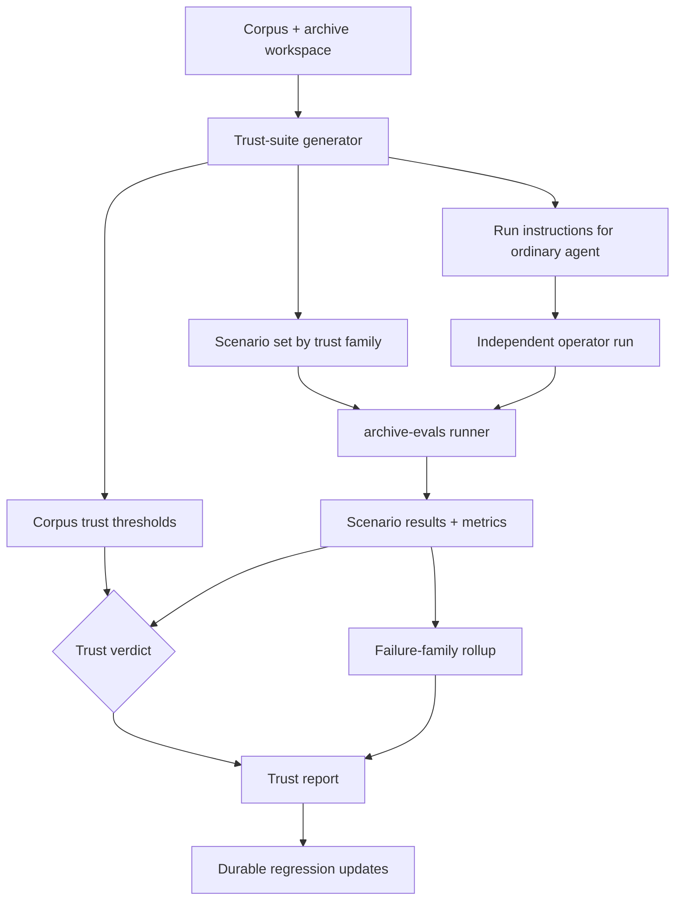

# feat: Add corpus trust eval meta-skill

## Summary

Add a Ledger meta-skill that can generate and maintain a corpus-specific trust suite, run it against an ordinary agent operating a real archive, and produce a trust verdict that is stricter than generic eval green-ness. The trust bar is corpus-level: real-question pass rate, golden and critical-path health, safe archive-growth behavior, and failure-family visibility.

This plan extends the existing `archive-evals` and independent-operator benchmark seams instead of creating a second benchmark stack.

---

## Problem Frame

Ledger already has three important pieces in place:

- generated archive workspaces with local operator guidance and deterministic gates
- an `archive-evals` lane that scores retrieval, grounding, boundary behavior, replay, expand mode, and false-completion behavior
- an independent Codex benchmark harness that can run cold operator-style questions and judge them against benchmark expectations

What is still missing is a reusable trust-eval layer that ties those pieces together into a corpus-level verdict. Right now trust is still too hand-built: one archive may have a useful benchmark, another may have only local evals, and neither shape cleanly answers the product question in `STRATEGY.md`: whether an ordinary agent can be trusted on that corpus while following the archive contract.

The missing layer is not another runtime or another benchmark platform. It is a stricter eval-building and verdict-producing contract that:

- generates real corpus-shaped question mixes per archive
- runs them against a normal archive operator flow
- scores both answer quality and process discipline
- applies explicit corpus-level thresholds
- groups failures into hardening families maintainers can act on

---

## Requirements

**Corpus trust suite generation**

- R1. The meta-skill must generate a corpus-specific eval suite whose purpose is to judge agent trustworthiness on that corpus.
- R2. The suite must include real corpus-shaped questions rather than only synthetic retrieval prompts.
- R3. The suite must cover direct rule lookups, exception-heavy questions, time/version-sensitive questions, and case-shaped research prompts when those families are material to the corpus.

**Ordinary operator under test**

- R4. The suite must run against an ordinary agent operating inside the archive workspace, using the local `AGENTS.md`, local skill, and deterministic archive scripts.
- R5. The suite must evaluate both process and outcome, so plausible answers with off-policy archive behavior do not count as clean passes.
- R6. The suite must exercise both local-support and weak-local-support questions that require canonical expansion and persistence when that is part of the archive contract.

**Trust scoring and verdicts**

- R7. The suite must define an explicit corpus-level trust threshold rather than only per-question grades.
- R8. The threshold must be driven by real-question pass rate with stricter minimums on golden and critical-path scenarios.
- R9. The suite must fail trust when the operator misses a material exception, answers from the wrong legal time/version state, overlooks a decisive relevant point, or presents unsupported certainty.

**Failure output and regression growth**

- R10. The trust report must group failures by family so maintainers can see whether the weakness is retrieval, exception coverage, temporal awareness, archive growth behavior, or answer posture.
- R11. Failed real questions must be reusable as durable regressions for that corpus.
- R12. The trust report must classify the archive/operator pair as `trustworthy_enough`, `not_yet_trustworthy`, or `passes_with_caveats`.

---

## High-Level Technical Design

The design keeps one reporting spine:

- `archive-evals` remains the canonical per-scenario runner and metric aggregator
- the independent-run harness remains the main ordinary-agent execution lane
- the new trust layer generates corpus-shaped scenarios, corpus trust thresholds, and a verdict/report overlay on top of the existing metrics

That preserves Ledger's current strategy: deterministic checks and compact scripts own the gates, while agent behavior is tested through real archive operation rather than through a bespoke controller.

---

## Key Technical Decisions

- KTD1. **Build trust evals as an `archive-evals` extension, not a parallel system:** scenario files, thresholds, reports, and benchmark summaries should stay in the current eval lane so trust proof composes with the existing archive contract.
- KTD2. **Standardize threshold shape as overall plus priority floors:** the first trust verdict should require overall pass health and separate golden and critical-path minimums rather than a single suite-wide percentage.
- KTD3. **Use ordinary-run evidence as the primary truth source:** trust must be decided from cold operator-style runs plus deterministic evidence capture, not from polished final prose alone.
- KTD4. **Keep first generated suites small and high-signal:** start with a compact set of real questions per corpus, then grow from durable failures instead of scaffolding broad speculative coverage.
- KTD5. **Report trust by failure family, not only by bucket:** retrieval, grounding, and boundary buckets are useful but not enough; maintainers need hardening families like exception miss, temporal drift, unsupported certainty, and weak growth behavior.

---

## Scope Boundaries

### In scope

- Meta-skill and scaffolding changes needed to generate corpus-specific trust suites from archive context and corpus docs.
- `archive-evals` schema, threshold, and reporting changes needed to emit trust-family coverage and trust verdicts.
- Independent-run harness changes needed to run and summarize ordinary-agent trust checks against those suites.
- One live proof on the current `archive-index` workspace using existing legal benchmark material and archive policy.

### Deferred to Follow-Up Work

- Cross-model comparison dashboards or leaderboard-style reporting across multiple agent providers.
- Large-scale benchmark fleet management across many archives.
- Fully automated trust-suite expansion from raw production traces without maintainer review.

### Deferred for later

- Broader non-legal corpus transfer proof after the first trust-eval contract is stable.
- Richer longitudinal trust trends across repeated archive revisions.

### Outside this product's identity

- A generic legal benchmark detached from archive operation.
- A runtime that replaces local skills and deterministic archive gates.
- Scoring that rewards polished answer prose while ignoring off-policy archive behavior.

---

## System-Wide Impact

- `archive-evals` becomes the home not just for archive readiness but for corpus trust verdicts.
- Generated archives will need a clearer starter trust posture alongside existing eval scenarios and threshold scaffolds.
- The independent-run harness will become more central because it is the most natural place to test ordinary-agent behavior under archive rules.
- Future archive plans can distinguish more clearly between "evals are green" and "an ordinary agent is trustworthy enough on this corpus."

---

## Risks & Dependencies

- If the trust verdict duplicates existing eval metrics without adding a sharper decision rule, the feature will look substantial without changing maintainer behavior.
- If the generated trust suites are too broad in v1, they will become expensive to maintain before they become trusted.
- If trust-family labels are vague, failures will be harder to convert into the next hardening move.
- If ordinary-run capture is too manual, the new lane will not actually scale beyond the flagship archive.
- This work depends on preserving the existing archive proof rule: repo tests alone are not enough when archive operation behavior changes.

---

## Acceptance Examples

- AE1. A corpus with an exception-heavy rule produces a trust scenario that fails the operator if it returns only the base rule.
- AE2. A corpus with recent legal changes produces a time-sensitive scenario that fails the operator for answering from the wrong version or omitting the temporal caveat.
- AE3. A weak-local-support scenario requires expansion, persistence, and archive rebuild evidence; a plausible final answer without that process is not treated as a clean pass.
- AE4. A mixed trust suite produces an explicit verdict with separate visibility into overall, golden, and critical-path health.

---

## Sources / Research

- `STRATEGY.md`
- `archive-index/TESTING.md`
- `archive-index/AGENTS.md`
- `skills/archive-evals/SKILL.md`
- `skills/archive-evals/references/scenario-schema.md`
- `skills/archive-evals/references/buckets-and-reporting.md`
- `skills/archive-evals/scripts/run_archive_evals.py`
- `skills/archive-evals/scripts/benchmark_independent_codex.py`
- `skills/domain-archive-pack-builder/scripts/scaffold_domain_pack.py`
- `tests/unit/test_archive_evals_reporting.py`
- `tests/unit/test_independent_codex_benchmark.py`
- `docs/evals/2026-05-28-portuguese-legal-qa-seed-benchmark-results-growing-operator.md`
- `docs/evals/2026-05-28-dr-only-edge-case-portuguese-legal-benchmark.md`

---

## Implementation Units

### U1. Define the corpus trust suite contract

- **Goal:** Add a reusable trust-suite contract that tells maintainers how to generate a corpus-specific mix of real questions, trust families, and corpus-level thresholds.
- **Requirements:** R1, R2, R3, R7, R8, R10, R12
- **Dependencies:** None
- **Files:** `skills/archive-evals/SKILL.md`, `skills/archive-evals/references/scenario-schema.md`, `skills/archive-evals/references/buckets-and-reporting.md`, `skills/archive-evals/scripts/scaffold_archive_evals.py`, `tests/unit/test_archive_evals_reporting.py`
- **Approach:** Extend the current scenario schema and scaffold flow with trust-family metadata, corpus trust threshold sections, and verdict vocabulary instead of inventing a new manifest shape. The trust families should sit above the current retrieval/grounding/boundary buckets and let one scenario carry both its eval bucket and its trust failure family.
- **Patterns to follow:** Reuse the current `case_metadata`, `answer_expectations`, `run_mode`, and threshold structure already used for golden cases, expand mode, replay, and false-completion proof.
- **Test scenarios:**
  - A scaffolded trust suite includes a small real-question mix covering direct lookup, exception-heavy, time-sensitive, and case-shaped scenarios when the corpus requires them.
  - Trust thresholds can require both overall pass health and golden or critical-path minimums without breaking existing archive-evals threshold parsing.
  - A scenario can declare a trust failure family such as `exception_miss` or `temporal_drift` without losing its retrieval or grounding bucket classification.
  - Reports with no trust metadata continue to render cleanly as plain archive-evals results.
- **Verification:** A maintainer can scaffold a trust-oriented eval workspace from existing archive context without hand-designing the report shape or verdict rules from scratch.

### U2. Extend the eval runner to compute trust verdicts and failure families

- **Goal:** Teach the archive-evals runner to aggregate trust-family failures and emit a corpus-level verdict on top of existing per-scenario results.
- **Requirements:** R5, R7, R8, R9, R10, R12
- **Dependencies:** U1
- **Files:** `skills/archive-evals/scripts/run_archive_evals.py`, `skills/archive-evals/references/buckets-and-reporting.md`, `tests/unit/test_archive_evals_reporting.py`, generated `archive-evals/thresholds.json`
- **Approach:** Add a trust-summary layer to the existing report builder. It should consume scenario-level outcomes, priority-case health, and trust-family metadata to produce verdicts like `trustworthy_enough`, `passes_with_caveats`, and `not_yet_trustworthy`, plus a family-grouped failure rollup and next hardening recommendation.
- **Execution note:** Start with characterization coverage around current summary and threshold behavior before changing report shape, so the trust overlay lands without regressing replay, expand-mode, or false-completion reporting.
- **Patterns to follow:** Follow the existing `suite_health`, `recommended_hardening_steps`, and threshold-evaluation structure in `run_archive_evals.py`.
- **Test scenarios:**
  - A suite with strong overall results but a failing golden scenario yields a non-passing trust verdict.
  - A suite with acceptable overall and priority-case health but visible non-blocking drift yields `passes_with_caveats`.
  - A suite with repeated `temporal_drift` or `unsupported_certainty` failures groups those families in the trust report instead of only listing raw scenario ids.
  - Existing reports without trust metadata still compute thresholds and archive-level summaries correctly.
- **Verification:** The runner can explain not just whether the suite passed thresholds, but whether the archive/operator pair is trustworthy enough and why.

### U3. Extend the independent operator harness for corpus trust runs

- **Goal:** Use the existing cold-run harness as the ordinary-agent execution lane for trust suites, with structured evidence capture that the eval runner can consume.
- **Requirements:** R4, R5, R6, R9, R11
- **Dependencies:** U1, U2
- **Files:** `skills/archive-evals/scripts/benchmark_independent_codex.py`, `tests/unit/test_independent_codex_benchmark.py`, `skills/archive-evals/references/scenario-schema.md`, `docs/evals/2026-05-28-dr-only-edge-case-portuguese-legal-benchmark.md`
- **Approach:** Generalize the current benchmark harness from benchmark-doc parsing plus answer grading into a trust-run input/output contract. The harness should capture structured evidence about source discipline, persistence, support posture, and allowed-source behavior so trust scenarios can score process as well as outcome.
- **Patterns to follow:** Reuse the current JSON schema discipline for run payloads and judge payloads rather than introducing free-form transcripts as the primary machine-readable source.
- **Test scenarios:**
  - A trust run captures whether expansion and persistence happened when the scenario required weak-local-support closure.
  - A source-constrained scenario fails process scoring when the run drifts outside allowed canonical source hosts even if the answer text is plausible.
  - A time-sensitive scenario records enough evidence for the judge layer to identify wrong-version answering versus acceptable temporal caveat behavior.
  - A failed trust run can be converted into a durable regression input without manually rewriting the run artifact.
- **Verification:** An ordinary-agent run produces structured evidence rich enough for the trust suite to grade both behavior and outcome.

### U4. Prove the trust-eval contract on the flagship archive

- **Goal:** Show that the current `archive-index` workspace can use the new trust layer to produce a meaningful corpus trust verdict from real legal benchmark material.
- **Requirements:** R2, R3, R4, R6, R10, R11, R12
- **Dependencies:** U2, U3
- **Files:** `archive-index/archive-evals/scenarios/*.json`, `archive-index/archive-evals/thresholds.json`, `archive-index/archive-evals/reports/latest.json`, `docs/evals/2026-05-28-portuguese-legal-qa-seed-benchmark-results-growing-operator.md`, `docs/evals/2026-05-28-dr-only-edge-case-portuguese-legal-benchmark.md`
- **Approach:** Seed the first trust suite from the existing Portuguese legal archive proof surface rather than inventing synthetic data. The first live trust lane should cover at least one direct local-support case, one exception-heavy case, one time-sensitive case, and one weak-local-support expansion case, then report a trust verdict with clear failure families and regression candidates.
- **Execution note:** Use the live `archive-index` workspace and its local policy/test doctrine, not only repo fixtures. The proof should satisfy the repo's archive proof ladder: tests, evals, and at least one real agent-style trial.
- **Patterns to follow:** Mirror the recent live-proof style used for growing-operator runs and DR-only edge-case pressure rather than creating a purely synthetic fixture suite.
- **Test scenarios:**
  - A direct local-support legal question passes trust cleanly with strong archive-local evidence.
  - An exception-heavy legal rule fails trust when the operator omits the decisive exception, even if core retrieval succeeded.
  - A time-sensitive legal question fails trust when the run answers from the wrong legal version or fails to mark the temporal caveat.
  - A weak-local-support question passes only when the operator expands canonically, persists reusable material, rebuilds the archive, and answers with the right posture.
- **Verification:** The flagship archive produces a trust verdict and actionable failure-family output that are sharper than a plain green eval summary.

### U5. Feed trust failures back into durable corpus regressions

- **Goal:** Make trust failures improve the suite over time instead of remaining one-off observations in eval writeups.
- **Requirements:** R10, R11
- **Dependencies:** U2, U3, U4
- **Files:** `skills/archive-evals/SKILL.md`, `skills/archive-evals/scripts/scaffold_archive_evals.py`, `skills/archive-evals/references/buckets-and-reporting.md`, `tests/unit/test_archive_evals_reporting.py`
- **Approach:** Extend the existing eval maintenance guidance so trust failures become regression candidates with explicit origin and failure-family metadata. The first version can stop at deterministic scaffolding and report guidance rather than attempting automatic scenario creation from every failed run.
- **Patterns to follow:** Reuse the current `production_derived` and stale-case hygiene model in `archive-evals` instead of introducing a separate regression registry.
- **Test scenarios:**
  - A trust failure from a real run is surfaced as a recommended `production_derived` regression with the right failure-family label.
  - Regression scenarios retain golden or coverage posture separately from their failure-family metadata.
  - Reports identify when a corpus trust suite still lacks enough production-derived regressions to justify confidence.
  - Trust-suite maintenance guidance remains small and does not encourage speculative suite growth.
- **Verification:** Maintainers can turn a real trust failure into durable suite coverage without designing the metadata shape by hand.
