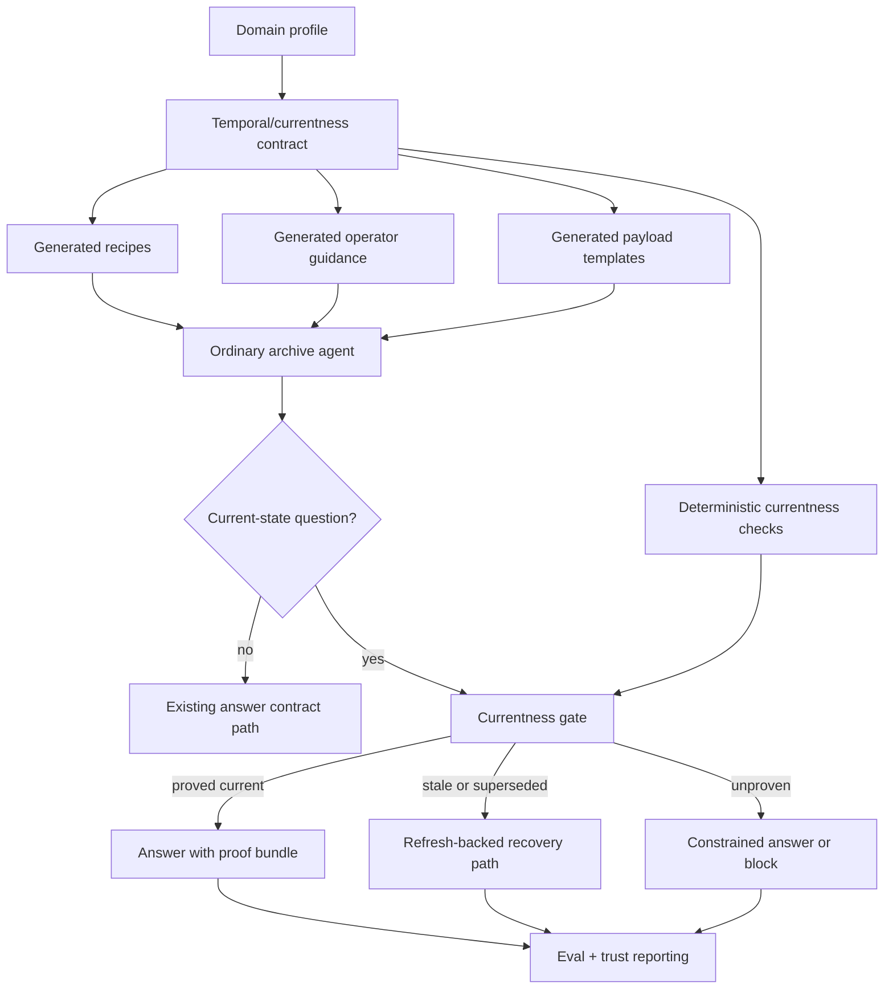

# feat: Add cross-index temporal currentness contract

## Summary

Extend Ledger's generic meta-skill stack so generated archives can express and enforce temporal/currentness behavior when the corpus needs it. The first proving ground is Portuguese `diariodarepublica.pt` current-law lookup, but the product change is generic: new pack contract surfaces, generated operator guidance, deterministic currentness checks, and eval/reporting support for stale or superseded-answer failures.

---

## Problem Frame

Ledger already has the right architectural split for bounded archives:

- domain packs define policy and source-family behavior
- generated archive-local guidance teaches future agents how to operate safely
- deterministic checks own the hard gates
- evals and trust reports prove whether ordinary agents can operate the archive well

That stack already handles coverage weakness, support hierarchy, exact wording, confirmation boundaries, bounded expansion, and trust-family reporting. What it does not yet handle cleanly is temporal safety as a reusable meta capability. Right now freshness is mostly a policy signal such as `refresh_before_answer` and `verified_at`, which is useful but weaker than proving that relied-on support is still current or has been superseded.

The implementation goal is therefore not "make one DR archive smarter." It is to upgrade the generic contract so any future archive can opt into temporal/currentness behavior through generated pack surfaces and deterministic helper checks, with DR legislation serving as the first hard proving ground.

---

## Requirements

**Cross-index temporal contract**

- R1. Ledger must extend the generic domain-pack contract so generated archives can express temporal/currentness and supersession behavior when the corpus requires it.
- R2. The generated contract must distinguish current-law or current-state question shapes from other question shapes and allow stronger currentness rules for those shapes.
- R3. The generated contract must define a minimal temporal model strong enough to mark support as current, stale, superseded, or unproven for current-state use.
- R4. The contract must stay stronger than metadata and weaker than orchestration; it must not collapse into a corpus-specific runtime.

**Generated operator surfaces**

- R5. Generated archive-local guidance must teach ordinary agents when currentness checks are required before decisive output and how to respond when currentness cannot be proven.
- R6. Generated templates and recipe files must make temporal/currentness decisions inspectable and editable by maintainers rather than burying them in prose-only guidance.

**Deterministic gates**

- R7. Ledger must add deterministic helper checks that can block current-state answers when the archive cannot prove the relied-on support is still current.
- R8. The deterministic layer must distinguish "checked recently" from "proved current" and must be able to identify stale or superseded support for current-state use.
- R9. Currentness and supersession results must feed answer posture and trust/eval reporting rather than remaining silent internal state.

**Eval and trust**

- R10. Ledger must generate temporal/currentness eval scenarios and trust-family reporting that fail when a generated archive answers from stale or superseded support.
- R11. The eval and trust layer must treat temporal/currentness failure as a distinct hardening family rather than hiding it under generic retrieval or grounding misses.

**Flagship proof**

- R12. The first proving ground must show that the new generic contract works for Portuguese `diariodarepublica.pt` current-law article/provision lookup without making DR the product boundary.
- R13. The proving ground must include human-visible proof-bundle behavior showing at least when the source was checked and the canonical link used.

---

## High-Level Technical Design

The design keeps the current Ledger spine intact:

- the domain-pack layer owns corpus policy
- generated archive-local surfaces teach future agents how to operate
- deterministic helper checks own the hard temporal gate
- eval and trust layers prove whether the generated behavior prevents stale current-state answers

The new capability should enter the system as reusable contract surfaces and helper-sized checks, not as a second orchestration framework.

---

## Key Technical Decisions

- KTD1. **Introduce a generic temporal/currentness contract, not a DR-only feature:** new pack outputs and helper checks should be reusable by any archive that needs temporal safety, with DR only as the first proving ground.
- KTD2. **Keep the temporal model intentionally thin in v1:** generated archives should be able to represent `current`, `stale`, `superseded`, and `unproven` support without requiring a full historical lineage or amendment graph.
- KTD3. **Treat currentness as a question-shape gate, not a global always-on rule:** the contract should allow stricter currentness rules for current-state questions while preserving lighter behavior for other question shapes.
- KTD4. **Deterministic checks should validate temporal state, not semantic truth:** the helper layer should prove whether support is eligible for current-state use, while leaving legal synthesis and interpretation with the agent.
- KTD5. **Proof should be user-visible as well as machine-readable:** the generic contract must support a proof bundle that a human can inspect quickly, not only internal pass/fail state.
- KTD6. **Extend the existing trust/eval taxonomy rather than creating a temporal-only lane:** temporal/currentness failures should join the current report structure as a distinct hardening family.

---

## Scope Boundaries

### In scope

- Generic domain-pack contract changes for temporal/currentness behavior
- Generated recipe, operator-guidance, and payload-template changes
- Deterministic helper-check extensions for currentness and supersession
- Eval and trust-reporting support for stale or superseded-answer failures
- One DR current-law proving ground demonstrating the generic contract

### Deferred to Follow-Up Work

- Full historical or as-of-date question support
- Rich amendment-lineage presentation in proof bundles
- Automatic temporal modeling for every source family without maintainer tuning

### Deferred for Later

- Full version-graph support for archives that need deep historical navigation
- Broader non-DR proving grounds after the generic contract is stable

### Outside This Product's Identity

- A corpus-specific legal runtime
- Replacing agent judgment with a temporal workflow engine
- Autonomous final legal conclusions for case outcomes

---

## System-Wide Impact

- The domain-pack layer becomes responsible for one more reusable decision surface: temporal/currentness posture.
- Generated archives gain a new class of editable machine-readable policy instead of relying on freshness prose alone.
- The archive helper layer adds temporal gating alongside the existing coverage, support, and confirmation checks.
- The eval and trust layers become sharper about one of the repo's most important high-stakes failure modes: plausible but outdated answers.

---

## Risks & Dependencies

- If the temporal model is too thin, it will collapse back into a renamed freshness flag and fail to block stale answers.
- If it is too heavy, the first version will turn into a legal-versioning system rather than a meta-skill upgrade.
- If currentness checks become DR-specific in shape, they will weaken the claim that the product change is generic.
- If the proving ground is too broad, the plan risks spending effort on source-family variance before the contract itself is proven.
- This work depends on preserving the repo's current split: packs and generated guidance own policy, helper scripts own deterministic gates, and agents still own reasoning.

---

## Success Metrics

- Generated packs can declare temporal/currentness posture through machine-readable outputs rather than freshness prose alone.
- A generated archive can mark relied-on support for current-state use as `current`, `stale`, `superseded`, or `unproven`.
- The helper layer can block stale or superseded support from passing as valid current-state support in the proving-ground corpus.
- Trust/eval reports can surface temporal/currentness failures as a distinct family such as `temporal_drift` or `superseded_support`.
- On the DR proving ground, wrong-version current-law paths fail and refresh-backed current-law paths pass with proof-bundle output.

---

## Acceptance Examples

- AE1. A generated pack for a time-sensitive corpus emits explicit temporal/currentness recipe surfaces and operator guidance rather than relying only on `verified_at` output requirements.
- AE2. An archive answering a current-state question from support that has been updated since the local slice was created is blocked from presenting that support as current.
- AE3. An archive that refreshed recently but cannot prove the relied-on support still matches the current canonical state returns a constrained answer posture instead of unsupported certainty.
- AE4. The trust report for a proving-ground archive groups wrong-version and stale-support failures under a temporal/currentness family rather than generic retrieval failure.

---

## Sources / Research

- `STRATEGY.md`
- `docs/brainstorms/2026-06-01-dr-currentness-supersession-meta-skill-requirements.md`
- `docs/brainstorms/2026-05-27-domain-pack-product-surface-requirements.md`
- `docs/brainstorms/2026-05-28-corpus-trust-eval-meta-skill-requirements.md`
- `docs/brainstorms/2026-05-28-legal-research-assistant-confidence-bar-requirements.md`
- `docs/plans/2026-05-27-001-feat-self-growing-canonical-archives-plan.md`
- `docs/plans/2026-05-28-001-feat-meta-index-practices-plan.md`
- `docs/plans/2026-05-28-003-feat-corpus-trust-eval-meta-skill-plan.md`
- `skills/domain-archive-pack-builder/SKILL.md`
- `skills/domain-archive-pack-builder/references/domain-pack-contract.md`
- `skills/domain-archive-pack-builder/references/domain-profile-schema.md`
- `skills/domain-archive-pack-builder/references/generated-pack-outputs.md`
- `skills/domain-archive-pack-builder/references/operator-skill-contract.md`
- `skills/archive-index-builder/references/verifier-toolkit.md`
- `skills/archive-evals/references/scenario-schema.md`

---

## Implementation Units

### U1. Extend the generic domain-pack contract with temporal/currentness surfaces

- **Goal:** Define the reusable pack-level contract for temporal/currentness behavior so future generated archives can opt into it without bespoke local design.
- **Requirements:** R1, R2, R3, R4
- **Dependencies:** None
- **Files:** `skills/domain-archive-pack-builder/SKILL.md`, `skills/domain-archive-pack-builder/references/domain-pack-contract.md`, `skills/domain-archive-pack-builder/references/domain-profile-schema.md`, `skills/domain-archive-pack-builder/references/generated-pack-outputs.md`, `skills/domain-archive-pack-builder/references/operator-skill-contract.md`
- **Approach:** Extend the generic contract to define a new temporal/currentness layer adjacent to freshness, not buried inside it. The contract should name the minimum concepts generated archives must be able to express for current-state use, how question shapes trigger the stronger gate, and what editable outputs future maintainers receive.
- **Patterns to follow:** Mirror the existing cross-index practice pattern from the meta-index plan: new behavior should enter through generated contract surfaces and judgment points rather than archive-specific action scripting.
- **Test scenarios:**
  - The contract clearly distinguishes freshness posture from currentness/supersession posture.
  - A planner or maintainer can tell which parts of the temporal model are generic and which remain archive-local proving-ground detail.
  - The contract remains stronger than metadata and weaker than orchestration rather than reading like a runtime design.
- **Verification:** Another implementer can read the references and understand how a future domain pack is supposed to express temporal/currentness behavior without inferring it from one legal example.

### U2. Generate temporal/currentness recipes, templates, and operator guidance

- **Goal:** Materialize the new generic contract into generated archive-local outputs that future agents can actually use.
- **Requirements:** R1, R2, R5, R6
- **Dependencies:** U1
- **Files:** `skills/domain-archive-pack-builder/scripts/scaffold_domain_pack.py`, `skills/domain-archive-pack-builder/scripts/validate_domain_pack.py`, `skills/domain-archive-pack-builder/scripts/benchmark_domain_pack.py`, `tests/unit/test_domain_archive_pack_builder.py`, generated `domain/OPERATIONS.md`, generated `domain/ENRICHMENT_PROTOCOL.md`, generated `skills/<domain-slug>-operator/SKILL.md`, generated `templates/domain-pack/*.json`
- **Approach:** Extend the scaffolded pack outputs with explicit temporal/currentness recipe surfaces and the corresponding operator instructions. The generated docs should make current-state questions, proof-bundle expectations, and currentness failure posture part of the normal operator loop alongside existing support and confirmation checks.
- **Execution note:** Start with characterization coverage around current generated outputs so the new surfaces land as an additive extension to the existing contract.
- **Patterns to follow:** Match the current builder style where `scaffold_domain_pack.py` owns the stable generated structure and `validate_domain_pack.py` enforces that generated operator guidance references the right files and phrases.
- **Test scenarios:**
  - A generated pack includes temporal/currentness outputs in addition to `freshness-rules.yaml`.
  - Generated operator guidance references the new temporal/currentness surfaces and explains when they matter.
  - Validation fails if a generated pack omits required temporal/currentness outputs when the profile declares them relevant.
  - Benchmark checks can detect whether the generated pack actually carries the new temporal posture.
- **Verification:** A newly generated archive exposes explicit temporal/currentness operating surfaces without requiring the maintainer to invent them by hand after scaffolding.

### U3. Add helper-sized deterministic currentness and supersession gates

- **Goal:** Extend the existing archive helper layer with temporal checks that can block stale current-state output without turning the helper into a legal-specific runtime.
- **Requirements:** R7, R8, R9
- **Dependencies:** U1, U2
- **Files:** `skills/archive-index-builder/scripts/scaffold_archive_index.py`, generated `scripts/archive_verifier.py`, generated `scripts/run_archive_check.py`, `skills/archive-index-builder/references/verifier-toolkit.md`, `tests/unit/test_archive_run_archive_check.py`, `tests/unit/test_domain_archive_answer_checks.py`
- **Approach:** Add new currentness-oriented checks to the existing helper family so generated archives can validate current-state eligibility of relied-on support. The checks should operate on archive-declared temporal identity and canonical recheck results, returning machine-readable outcomes such as `current`, `stale`, `superseded`, or `unproven` for answer-posture decisions.
- **Execution note:** Add characterization coverage around existing helper command dispatch before extending the helper surface so current checks land without regressing `check_coverage_state`, `check_auto_expand_decision`, `check_support_hierarchy`, or `check_confirmation_boundary`.
- **Patterns to follow:** Match the current `run_archive_check.py` pattern: helper-sized JSON checks, `uv run python` default commands, and explicit integration with generated recipes rather than hidden logic.
- **Test scenarios:**
  - A current-state question with support marked current passes the temporal gate.
  - A current-state question with stale support is blocked from decisive output.
  - A support item marked superseded is blocked distinctly from merely stale support.
  - A recently checked but still unproven support state is treated differently from a proved-current state.
  - Existing non-temporal helper checks continue to work unchanged.
- **Verification:** Generated archives can use deterministic helper checks to stop stale or superseded support from masquerading as valid current-state support.

### U4. Extend eval and trust reporting for temporal/currentness failures

- **Goal:** Make the eval/reporting layer able to represent and summarize temporal/currentness failures as a first-class hardening family.
- **Requirements:** R9, R10, R11
- **Dependencies:** U3
- **Files:** `skills/archive-evals/scripts/run_archive_evals.py`, `skills/archive-evals/references/scenario-schema.md`, `skills/archive-evals/references/buckets-and-reporting.md`, `tests/unit/test_archive_evals_reporting.py`, `tests/unit/test_independent_codex_benchmark.py`
- **Approach:** Extend scenario metadata, report summarization, and trust-family rollups so temporal/currentness failures such as wrong-version answering, stale-support use, and currentness-unproven posture can be scored and surfaced cleanly. This should compose with the existing trust/failure-family design rather than creating a side channel.
- **Patterns to follow:** Reuse the existing `failure_class`, `case_metadata`, and suite-health reporting structure already planned for trust-family grouping.
- **Test scenarios:**
  - A scenario can declare a temporal/currentness failure family without losing its existing eval bucket classification.
  - Reports group repeated stale or superseded-support failures under a distinct family.
  - Trust verdict logic can distinguish a temporal/currentness failure from a generic retrieval miss.
  - Legacy scenarios with no temporal metadata still report correctly.
- **Verification:** Maintainers can tell from one report whether an archive is failing because it is outdated, not just because retrieval was weak.

### U5. Prove the generic contract on DR current-law article/provision lookup

- **Goal:** Demonstrate that the new generic temporal/currentness contract works on a real high-stakes corpus without making the implementation DR-specific in product shape.
- **Requirements:** R10, R11, R12, R13
- **Dependencies:** U2, U3, U4
- **Files:** `archive-index/archive-evals/scenarios/*.json`, `archive-index/archive-evals/thresholds.json`, `docs/evals/2026-05-28-dr-only-edge-case-portuguese-legal-benchmark.md`, new or updated eval result docs under `docs/evals/`
- **Approach:** Use Portuguese DR current-law article/provision lookup as the first pressure test for the generic contract. The proving-ground suite should include at least one pass case with proof-bundle output, one stale-support failure, one superseded-support failure if corpus evidence allows it, and one unproven-currentness case that forces constrained output.
- **Execution note:** Treat the DR corpus as a proving-ground fixture for the generic contract. If corpus structure is inconsistent, narrow the proof slice rather than weakening the generic contract.
- **Patterns to follow:** Mirror the existing flagship-proof style used for bounded expansion and corpus trust evals: real archive, real scenarios, explicit failure-family reporting, and no second runtime.
- **Test scenarios:**
  - A refresh-backed current-law question passes with proof-bundle output including checked-at and canonical link.
  - A stale relied-on slice fails the currentness gate and is reported as a temporal/currentness failure.
  - A superseded relied-on slice fails distinctly when the corpus can prove that status.
  - A current-law question that cannot prove currentness returns constrained posture rather than unsupported certainty.
- **Verification:** The proving-ground archive shows that the generic contract prevents stale current-law answers and emits inspectable proof for valid ones.

---

## Open Questions

- What is the minimum generated temporal identity shape needed in the generic contract so helper checks can distinguish stale from superseded without overbuilding?
- Should the first generic outputs use one combined currentness recipe surface or separate currentness and supersession surfaces?
- How much corpus-specific tuning should the DR proving ground require before the generic contract is considered stable enough for a second domain?
