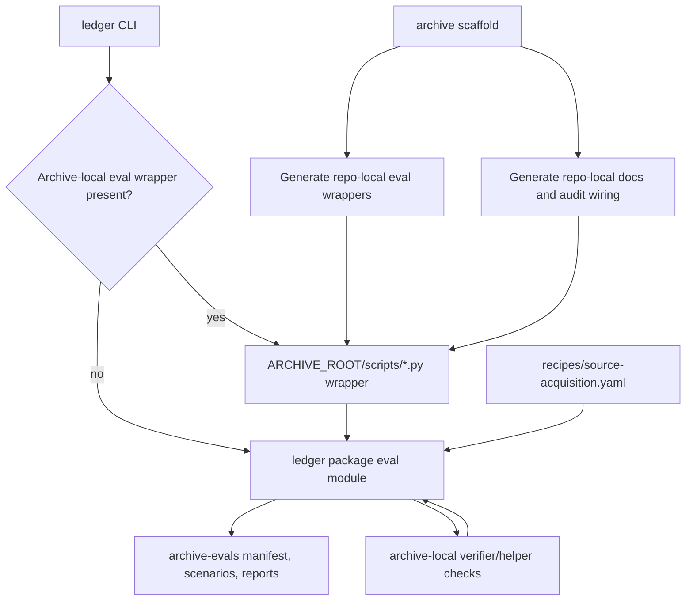

# feat: Make generated archives self-contained

## Summary

Make a freshly scaffolded Ledger archive runnable from its own repo by giving it repo-local eval wrappers, removing `ledger eval ...` dependence on runtime skill-file paths, and aligning eval/config wiring with the archive-local deterministic-gate philosophy.

This plan accepts the feedback direction, but implements it in a Ledger-native shape: package-owned logic with archive-local wrappers, not archive-local code forks.

---

## Problem Frame

Ledger is already succeeding at one part of the archive story: generated archives can rebuild their source-side and navigation indexes locally, and the core archive runtime is intentionally thin and agent-native.

The gap is the post-generation operating surface. Today:

- `ledger archive rebuild-index --root .` works as expected
- generated archives get local verifier and helper scripts such as `scripts/archive_verifier.py` and `scripts/run_archive_check.py`
- but `ledger eval scaffold`, `ledger eval run`, and `ledger eval generate-corpus` still dispatch to `skills/archive-evals/scripts/...` inside the Ledger runtime checkout

That means a generated archive is not actually self-contained after scaffolding. It can answer, rebuild, and verify locally, but its eval path still depends on the installed Ledger repo layout rather than the generated archive repo itself.

The feedback is directionally correct. The missing product surface is not index generation; it is self-contained eval/runtime glue. The Ledger-aligned correction is to preserve versioned deterministic logic in package modules while generating archive-local wrappers and docs that make the archive feel complete from its own repo.

---

## Requirements

- R1. A freshly generated archive workspace must include repo-local eval entrypoints so a maintainer can scaffold, run, and maintain evals from inside the archive repo.
- R2. `ledger eval ...` must stop depending on runtime `skills/archive-evals/scripts/...` path lookups when operating on a generated archive.
- R3. Ledger must preserve a single versioned source of truth for eval behavior rather than encouraging archive-local logic forks.
- R4. Generated archive eval wrappers must call stable package modules or equivalent Ledger-owned logic, not duplicated copies of the eval implementation.
- R5. Generated archive docs must point users at the real supported path from day one: archive-local scripts and archive-local commands.
- R6. Generated audit and verification flows must call repo-local eval wrappers where eval execution is part of the archive operating workflow.
- R7. Eval/config consumers must use a consistent `question_shape_policies` contract across generated archives, helper checks, and eval runners.
- R8. During migration, Ledger must tolerate both the old mapping-shaped eval expectation and the current list-of-entry scaffold shape where necessary, so existing archives do not break abruptly.
- R9. The solution must follow Ledger’s philosophy: deterministic gates remain small, explicit, and inspectable in the archive repo; judgment and synthesis stay with the agent and local archive guidance.
- R10. The resulting archive repo must be understandable as a standalone operator surface without requiring repo archaeology in the Ledger source tree.

---

## High-Level Technical Design

The key shape is:

- archive repos get local script entrypoints
- those entrypoints stay thin and defer to Ledger-owned package modules
- the CLI resolves toward archive-local operation first
- the config contract is normalized at the package boundary rather than reimplemented differently by each wrapper

This keeps the generated archive self-contained as an operating surface without turning Ledger into a code copier.

---

## Key Technical Decisions

- KTD1. **Use package-owned eval modules plus archive-local wrappers:** the generated archive should feel self-contained, but the actual eval logic should live under `src/ledger/` so behavior stays versioned and testable in one place.
- KTD2. **Prefer archive-local resolution for archive-scoped eval commands:** when the command targets an archive root, the CLI should look for `ARCHIVE_ROOT/scripts/*.py` wrappers before falling back to package execution.
- KTD3. **Keep wrapper scripts intentionally thin:** generated `scripts/run_archive_evals.py` and friends should be stable operator entrypoints, not copied business logic that drifts from the package.
- KTD4. **Standardize the scaffolded `question_shape_policies` shape as the domain-pack list-of-entries contract:** that is already the stronger repo direction in domain-pack validation and helper checks, so eval consumers should align to it rather than pull the scaffold back toward a mapping.
- KTD5. **Support both config shapes during the migration window:** existing archives and tests may still exercise the older mapping assumption, so the package layer should normalize input rather than forcing a flag day.
- KTD6. **Generated docs should describe the archive repo as the primary operating surface:** the user should not need to know where Ledger stores skill scripts in order to run evals on their archive.

---

## Scope Boundaries

### In scope

- Packaging the eval runner behind stable Ledger modules
- Generating archive-local eval wrappers during scaffold
- Updating `ledger eval ...` resolution for archive-scoped commands
- Config-shape normalization and migration compatibility
- Generated docs, audit wiring, and tests needed to prove the self-contained contract

### Deferred to Follow-Up Work

- Making the independent benchmark harness universally generated into every archive repo by default if it is still optional for some archive classes
- Broader cleanup of repo skill/runtime path lookups outside the archive/eval surface
- Distribution/versioning UX for archives that intentionally pin one Ledger version for long-lived offline use

### Outside this product’s identity

- Copying the full eval implementation into every generated archive
- Turning Ledger into a heavy orchestrator or runtime manager
- Replacing archive-local deterministic scripts with opaque package-only behavior

---

## System-Wide Impact

- `src/ledger/cli.py` stops treating evals as repo-internal skill scripts and instead becomes an archive-aware dispatcher.
- `skills/archive-index-builder/scripts/scaffold_archive_index.py` expands from archive/verifier scaffolding into a fuller standalone operator surface.
- `skills/archive-evals/scripts/*.py` likely become transitional adapters or move behind importable package modules.
- Domain-pack and eval tooling align more tightly on one config contract for `question_shape_policies`.
- Archive docs become more honest about the supported operating path for standalone generated repos.

---

## Risks & Dependencies

- If the wrapper scripts become more than thin adapters, Ledger will create drift-prone archive-local logic copies.
- If the CLI only falls back to package modules and does not recognize archive-local wrappers, the generated repo still will not feel self-contained.
- If the config migration standardizes on the wrong shape, Ledger could regress the stronger domain-pack contract it already established.
- If audit and benchmark tooling are only partially rewired, the repo will remain inconsistent: some flows local, some flows runtime-relative.
- This work depends on preserving the Ledger split already established in `STRATEGY.md`: package and scripts own deterministic gates; archive-local guidance owns operation posture; agents own reasoning.

---

## Acceptance Examples

- AE1. A newly scaffolded archive repo includes `scripts/run_archive_evals.py` and `scripts/scaffold_archive_evals.py`, and a maintainer can run evals from that repo without knowing where the installed Ledger skill tree lives.
- AE2. `ledger eval run <archive_root>` resolves cleanly when the archive has local eval wrappers, and still works when only package-level execution is available.
- AE3. A generated archive’s README and operator docs tell the maintainer to use repo-local eval paths rather than Ledger-internal `skills/...` paths.
- AE4. A list-shaped `question_shape_policies` recipe works end to end across helper checks, eval runners, and scaffolded archives without ad hoc local patching.
- AE5. An existing archive using the older config expectation continues to run during the migration window because the package layer normalizes both accepted shapes.

---

## Sources / Research

- `STRATEGY.md`
- `src/ledger/cli.py`
- `skills/archive-index-builder/scripts/scaffold_archive_index.py`
- `skills/archive-evals/SKILL.md`
- `skills/archive-evals/scripts/scaffold_archive_evals.py`
- `skills/archive-evals/scripts/run_archive_evals.py`
- `skills/domain-archive-pack-builder/scripts/check_expansion_plan.py`
- `skills/domain-archive-pack-builder/scripts/scaffold_domain_pack.py`
- `tests/unit/test_archive_index_skill_scaffold.py`
- `tests/unit/test_archive_evals_reporting.py`
- `tests/unit/test_archive_examples.py`
- `tests/unit/test_assets.py`
- `docs/plans/2026-05-28-003-feat-corpus-trust-eval-meta-skill-plan.md`
- `docs/plans/2026-06-01-001-feat-cross-index-temporal-currentness-contract-plan.md`

---

## Implementation Units

### U1. Move eval behavior behind stable Ledger package modules

- **Goal:** Replace runtime skill-file path dependence with importable, Ledger-owned eval modules that can be called from both the CLI and generated wrappers.
- **Requirements:** R2, R3, R4, R9
- **Dependencies:** None
- **Files:** `src/ledger/evals/__init__.py`, `src/ledger/evals/archive_evals.py`, `src/ledger/cli.py`, `skills/archive-evals/scripts/run_archive_evals.py`, `skills/archive-evals/scripts/scaffold_archive_evals.py`, `tests/unit/test_cli.py`, `tests/unit/test_archive_examples.py`
- **Approach:** Extract the current eval-script behavior into normal package modules under `src/ledger/`. Keep the existing skill-layer scripts as thin adapters during the transition so repo docs and tests do not need an immediate full rewrite. This makes `ledger eval ...` a package feature rather than a path lookup into `skills/`.
- **Patterns to follow:** Mirror the existing split already used for archive indexing: CLI commands call package code directly for core archive behavior and only shell to scripts where the repo still lacks a package seam.
- **Test scenarios:**
  - `ledger eval run <archive_root>` succeeds without opening a file under `skills/archive-evals/scripts/`.
  - The skill-layer wrapper still delegates correctly to the package module for backward compatibility.
  - Example archive eval tests continue to pass when routed through the package seam instead of direct script path imports.
  - Missing archive verifier/helper prerequisites still produce explicit failures with the same archive-local error posture.
- **Verification:** Eval execution is available as a normal package capability, and no archive-scoped CLI path depends on runtime skill-tree layout.

### U2. Generate archive-local eval wrappers as part of archive scaffold

- **Goal:** Make a fresh archive repo operationally complete by generating repo-local eval entrypoints alongside verifier and helper scripts.
- **Requirements:** R1, R4, R5, R6, R10
- **Dependencies:** U1
- **Files:** `skills/archive-index-builder/scripts/scaffold_archive_index.py`, generated `scripts/run_archive_evals.py`, generated `scripts/scaffold_archive_evals.py`, optional generated `scripts/benchmark_independent_codex.py`, `tests/unit/test_archive_index_skill_scaffold.py`, `tests/unit/test_assets.py`
- **Approach:** Extend archive scaffold generation so the archive gets thin wrapper scripts for eval scaffold/run flows. Treat the independent benchmark harness as optional unless Ledger decides every archive should ship it by default; the plan should preserve that decision explicitly rather than assuming it. The wrappers should import or invoke the package modules from U1, not embed duplicated logic.
- **Patterns to follow:** Follow the current `archive_verifier.py` and `run_archive_check.py` generation model: repo-local deterministic entrypoints with behavior owned centrally.
- **Test scenarios:**
  - A newly scaffolded archive contains local eval wrapper scripts in `scripts/`.
  - The generated wrappers run successfully against a minimal scaffolded archive-evals workspace.
  - The generated wrapper content does not duplicate large blocks of eval implementation logic.
  - If benchmark wrapper generation is optional, the scaffold output and docs stay consistent about when it is present.
- **Verification:** A user standing inside the generated archive repo can discover and run its eval surface locally without touching the Ledger source tree.

### U3. Make `ledger eval ...` archive-aware and wrapper-first

- **Goal:** Teach the CLI to resolve eval operations through the archive repo when appropriate, while preserving a package fallback.
- **Requirements:** R2, R5, R6, R10
- **Dependencies:** U1, U2
- **Files:** `src/ledger/cli.py`, `tests/unit/test_cli.py`, `tests/unit/test_archive_examples.py`
- **Approach:** Replace `_run_repo_script(...)` dispatch for archive-scoped eval commands with archive-aware resolution. For commands that operate on an archive root, the CLI should prefer the corresponding local wrapper under `ARCHIVE_ROOT/scripts/` when present, and otherwise invoke the package module directly. `summarize-examples` can stay package-owned because it is repo-level rather than archive-level.
- **Execution note:** Start from characterization coverage around current `ledger eval scaffold`, `generate-corpus`, and `run` behavior before changing dispatch, so the transition preserves current command semantics.
- **Patterns to follow:** Match the current CLI shape that already distinguishes archive-scoped behavior from repo-level benchmark summarization.
- **Test scenarios:**
  - `ledger eval scaffold <archive_root>` prefers `archive_root/scripts/scaffold_archive_evals.py` when present.
  - `ledger eval run <archive_root>` prefers `archive_root/scripts/run_archive_evals.py` when present.
  - Archive-scoped eval commands still work when the wrapper file is absent by falling back to the package module.
  - `ledger eval summarize-examples <examples_root>` remains repo-scoped and does not look for archive-local wrappers.
- **Verification:** The CLI behaves like an archive operator entrypoint, not a thin shortcut into internal Ledger repo file paths.

### U4. Normalize `question_shape_policies` handling around one contract

- **Goal:** Remove config-shape mismatch between scaffolded archives, helper checks, and eval consumers.
- **Requirements:** R7, R8, R9
- **Dependencies:** U1
- **Files:** `src/ledger/evals/archive_evals.py`, `skills/archive-evals/scripts/run_archive_evals.py`, `skills/domain-archive-pack-builder/scripts/check_expansion_plan.py`, `skills/archive-index-builder/scripts/scaffold_archive_index.py`, `tests/unit/test_archive_evals_reporting.py`, `tests/unit/test_domain_archive_expansion_plan.py`
- **Approach:** Standardize the emitted contract on the list-of-entry shape already used by domain-pack tooling, and add a normalization helper in the package eval layer that can read both list-shaped and mapping-shaped inputs during migration. Do not pull the scaffold back toward the older mapping assumption.
- **Patterns to follow:** Reuse the current domain-pack helper pattern that turns list-shaped `question_shape_policies` into a name-keyed map at runtime for validation.
- **Test scenarios:**
  - A list-shaped `question_shape_policies` recipe passes helper-check and eval-runner parsing unchanged.
  - A mapping-shaped legacy recipe still runs through the eval path during migration.
  - Query-budget checks behave identically after normalization regardless of source shape.
  - Scaffolded archives emit only the standardized list shape going forward.
- **Verification:** Maintainers see one authoritative config shape in generated archives, and legacy archives continue to operate until explicitly migrated.

### U5. Rewire generated docs and audit flows around the archive repo

- **Goal:** Make the generated archive’s docs, audit posture, and operator instructions consistently describe the archive repo as the real supported runtime surface.
- **Requirements:** R5, R6, R9, R10
- **Dependencies:** U2, U3, U4
- **Files:** `README.md`, `GETTING_STARTED.md`, `skills/archive-index-builder/scripts/scaffold_archive_index.py`, generated `README.md`, generated `AGENTS.md`, generated `TESTING.md`, generated audit/eval wrapper docs, `tests/unit/test_archive_index_skill_scaffold.py`, `tests/unit/test_assets.py`
- **Approach:** Update both Ledger’s repo docs and generated archive docs so they point at repo-local eval wrappers first. Ensure any audit wrapper or generated guidance that currently assumes a runtime skill path instead references the archive-local wrapper or the package-backed CLI entrypoint. Keep the docs explicit that Ledger still owns deterministic behavior; the archive simply exposes it locally.
- **Patterns to follow:** Match the recent source-index and verifier guidance shift: generated repos should be sibling/standalone operator surfaces, not folders that depend on a nearby Ledger checkout.
- **Test scenarios:**
  - Generated archive README and AGENTS text point to repo-local eval commands and not to `skills/archive-evals/scripts/...`.
  - Generated testing/audit guidance references archive-local wrappers or `ledger eval ...` in a way consistent with the new CLI resolution.
  - Root Ledger docs explain the self-contained archive operating model without implying copied logic.
  - No generated doc path assumes a sibling Ledger checkout to run evals successfully.
- **Verification:** A maintainer can follow the generated archive docs literally and land in the supported operating path without hidden runtime-path assumptions.

---

## Open Questions

- Should `scripts/benchmark_independent_codex.py` be generated into every archive by default, or remain an opt-in/archive-class-specific wrapper while the core eval scaffold becomes universal?
- Do we want archive-local eval wrappers to be executable via `uv run python scripts/...` only, or also documented as the preferred backend for `ledger eval ...` so the CLI remains the main operator UX?
