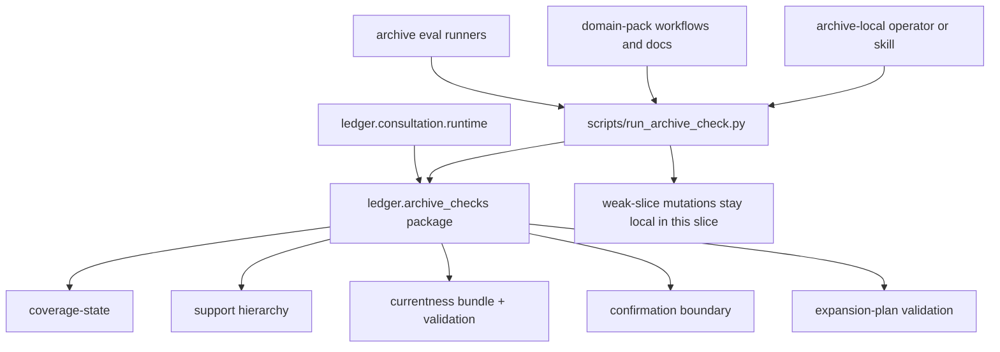

# feat: Package archive check runtime slice

## Summary

Package Ledger's highest-value read-oriented archive checks behind normal `src/ledger/` modules while keeping `scripts/run_archive_check.py` as the archive-local operator entrypoint. This slice covers coverage-state, support hierarchy, confirmation boundary, currentness proofing, and expansion-plan validation, plus the thin compatibility wiring needed for consultation and domain-pack flows to use the packaged seam.

---

## Problem Frame

The consultation slice established the first explicit operator runtime, but it still leans on a generated monolith: `scripts/run_archive_check.py` inside each archive repo owns both read-oriented trust gates and state mutations. That shape is now the main blocker to the next step in the broader operator-surface plan.

Today, the check helper mixes three kinds of behavior:

- deterministic read gates that should be versioned and reused centrally
- proof-bundle construction for currentness-sensitive answers
- state mutations such as provisional weak-slice registration and resolution

The strategic issue is not that the helper exists. The issue is that the read-oriented gates consultation, evals, and domain-pack workflows rely on are still trapped in scaffolded script code instead of package-owned seams. That makes the archive feel local, but it keeps the real trust logic in generated code and makes downstream reuse awkward.

The next bounded step is to package the read-first trust rails while preserving Ledger's archive-local operator posture:

- archive-local wrapper remains the operator UX
- package modules become the behavior source of truth
- mutation flows stay out of this slice so the check seam remains legible

---

## Requirements

- R1. Ledger must expose the highest-value read-oriented archive checks through package-owned modules under `src/ledger/`.
- R2. The archive-local `scripts/run_archive_check.py` entrypoint must remain the operator-facing boundary for generated archives in this slice.
- R3. The packaged seam must cover `check_coverage_state`, `check_support_hierarchy`, `check_confirmation_boundary`, `build_currentness_bundle`, `check_currentness`, and `check_expansion_plan`.
- R4. The packaged seam must preserve the current JSON payload shape and pass/fail semantics for those checks unless a compatibility adjustment is explicitly called out in the plan.
- R5. Consultation runtime code must stop depending on the generated helper for the checks covered by this slice and use the package seam directly.
- R6. Domain-pack and scaffolded archive workflows that currently rely on the covered checks must continue to work through the archive-local wrapper without behavior drift.
- R7. Proof-bundle construction for currentness is in-scope because it is a deterministic pre-answer proof rail, but state-mutating weak-slice registration and resolution are out of scope for this slice.
- R8. The implementation must preserve Ledger's expected operator execution posture: recipe-backed archive checks still run from the archive repo through `uv run python scripts/run_archive_check.py ...`.
- R9. The change must be provable with repo tests, focused archive-check tests, and one real archive trial against a sibling archive workspace.

---

## Key Technical Decisions

- KTD1. **Package read-only checks, not the whole helper.** This slice intentionally extracts only the deterministic read rails and leaves mutation helpers in the generated script so the first package seam stays narrow and coherent.
- KTD2. **Keep the archive-local wrapper as the operator UX.** Even after extraction, `scripts/run_archive_check.py` remains the entrypoint operators and local skills use from inside the archive repo.
- KTD3. **Treat currentness proof-bundle construction as part of the read seam.** `build_currentness_bundle` materializes a payload, but it is a deterministic proof-preparation step, not archive-state mutation, so it belongs with the packaged check rail.
- KTD4. **Move consultation onto the package seam in the same slice.** Leaving consultation on the generated helper after packaging the checks would preserve duplicate logic paths and undercut the value of the new boundary.
- KTD5. **Preserve payload compatibility first.** The package seam should emit the same JSON contract the existing helper and tests already rely on so downstream migration stays thin.

---

## High-Level Technical Design

The key boundary is:

- package owns read-only trust logic
- archive wrapper dispatches to package functions for covered checks
- local mutation commands remain in the wrapper until a later slice

---

## Scope Boundaries

### In scope

- package extraction of the covered read-only checks
- package extraction of currentness proof-bundle building
- archive-local wrapper delegation to the package seam
- consultation runtime migration to the package seam
- compatibility updates for scaffolded archive and domain-pack workflows that depend on the covered checks
- focused test and live-proof coverage for the new boundary

### Deferred to Follow-Up Work

- package extraction of `register_provisional_weak_slice`
- package extraction of `resolve_provisional_weak_slice`
- broader lifecycle/CRUD helpers for consultation or archive state
- structured contract/template migration in the generators and validators

### Outside This Slice

- final answer synthesis changes
- a packaged `ledger consult` primary UX
- a broad CLI redesign for all archive helper commands

---

## System-Wide Impact

This slice affects four connected surfaces:

- generated archive repos, because `scripts/run_archive_check.py` becomes thinner
- consultation runtime, because it will call package checks directly
- domain-pack validation and operator guidance, because those docs rely on the covered checks staying stable
- archive tests and sibling-archive proof flows, because the trust rail moves from scaffolded script code into package modules

The change is still localized in one important way: the operator contract does not change. Archives still run checks from inside the archive repo, and mutation commands remain where they are.

---

## Risks and Dependencies

- **Risk:** The package seam drifts from the wrapper's current JSON contract.
  - **Mitigation:** Characterize the existing outputs through focused tests first and preserve payload shape during extraction.

- **Risk:** Consultation and helper flows split between old and new code paths.
  - **Mitigation:** Move consultation onto the packaged seam in the same slice and keep the wrapper as a thin adapter only.

- **Risk:** This slice accidentally absorbs mutation behavior because the current helper interleaves it with checks.
  - **Mitigation:** Keep explicit file and unit boundaries around read-only functions vs. mutation commands, and defer the mutation extraction deliberately.

- **Dependency:** The current helper already contains the logic to extract. The plan assumes no new product behavior is needed, only boundary reshaping plus compatibility wiring.

---

## Sources & Research

- `STRATEGY.md` anchors the product direction: agent judgment stays local, scripts enforce deterministic gates, and the archive workspace remains the natural operator surface.
- `skills/archive-index-builder/scripts/scaffold_archive_index.py` is the current implementation source for the helper seam and shows the exact read-vs-mutate split that now needs packaging.
- `src/ledger/consultation/runtime.py` is the first downstream consumer that should move off the generated helper for covered checks.
- `skills/domain-archive-pack-builder/scripts/validate_domain_pack.py` and the generated domain-pack docs show which check names and contracts must remain stable.
- `tests/unit/test_archive_run_archive_check.py` already characterizes much of the helper's behavior and should be the compatibility floor for this slice.

---

## Implementation Units

### U1. Carve a package-owned archive-check runtime for read-only rails

- **Goal:** Create a package seam under `src/ledger/archive_checks/` for the covered deterministic checks.
- **Requirements:** R1, R3, R4, R7
- **Dependencies:** none
- **Files:** `src/ledger/archive_checks/__init__.py`, `src/ledger/archive_checks/runtime.py`, `tests/unit/test_archive_run_archive_check.py`, `tests/unit/test_archive_check_runtime.py`
- **Approach:** Extract the current helper logic for:
  - coverage-state
  - support hierarchy
  - confirmation boundary
  - currentness bundle construction
  - currentness validation
  - expansion-plan validation
  Keep the existing payload semantics and helper-shaped return structures. Use characterization coverage to lock current JSON behavior before moving logic.
- **Execution note:** Start characterization-first. Preserve existing helper outputs before changing the boundary.
- **Patterns to follow:** Mirror the consultation slice's package-owned runtime pattern under `src/ledger/consultation/`, but keep the check functions more data-oriented than CLI-oriented.
- **Test scenarios:**
  - `check_support_hierarchy` still infers support from indexed evidence artifacts and returns the current success payload.
  - `build_currentness_bundle` still derives `current|stale|superseded|unproven` from artifact metadata plus freshness state.
  - `check_currentness` still blocks non-current decisive answers with the existing failure shape.
  - `check_expansion_plan` still enforces question-shape and bounded-search rules from archive recipes.
  - `check_confirmation_boundary` still blocks confirmed conclusions when blocking facts remain unresolved.
- **Verification:** Package tests can invoke the covered checks directly without going through generated script code, while existing helper-focused tests remain green.

### U2. Turn `run_archive_check.py` into a thin adapter for packaged checks

- **Goal:** Keep the archive-local helper as the operator entrypoint while delegating covered commands to the package seam.
- **Requirements:** R2, R4, R6, R8
- **Dependencies:** U1
- **Files:** `skills/archive-index-builder/scripts/scaffold_archive_index.py`, generated `scripts/run_archive_check.py`, `tests/unit/test_archive_index_skill_scaffold.py`, `tests/unit/test_archive_run_archive_check.py`
- **Approach:** Update the scaffolded helper so the covered commands dispatch into `ledger.archive_checks` while local-only mutation commands stay implemented in the generated script for now. Keep argument names, output shape, and archive-local invocation posture stable.
- **Patterns to follow:** Reuse the thin-wrapper pattern already established for archive evals and consultation.
- **Test scenarios:**
  - A scaffolded archive still runs `check_coverage_state` successfully through `scripts/run_archive_check.py`.
  - A scaffolded archive still runs `build_currentness_bundle` and `check_currentness` through the local helper with unchanged payload shape.
  - Local mutation commands remain available in the helper and are not accidentally removed or package-routed in this slice.
  - Generated docs and helper behavior still point operators at `uv run python scripts/run_archive_check.py ...` for recipe-backed checks.
- **Verification:** Generated archives preserve the same local operator UX while the helper becomes a compatibility adapter rather than the logic owner.

### U3. Move consultation runtime onto the packaged check seam

- **Goal:** Make the consultation slice consume the packaged checks directly instead of shelling through the generated helper for covered behavior.
- **Requirements:** R5, R7
- **Dependencies:** U1
- **Files:** `src/ledger/consultation/runtime.py`, `tests/unit/test_consultation_runtime.py`
- **Approach:** Replace the consultation runtime's direct subprocess dependence on `scripts/run_archive_check.py` for covered checks with package calls into `ledger.archive_checks`. Keep the archive-local wrapper and audit artifact behavior unchanged.
- **Patterns to follow:** Keep consultation deterministic and conservative; do not expand this slice into final answer generation or mutation logic.
- **Test scenarios:**
  - Consultation still returns `expand` on generic latest-source questions without specific support.
  - Consultation still returns `ask_user` when required case-application facts are missing.
  - Consultation still respects currentness-sensitive downgrade behavior while using the packaged check seam.
- **Verification:** Consultation behavior stays the same, but its trust-gate dependency no longer goes through generated script code for the covered checks.

### U4. Preserve domain-pack and proof-flow compatibility

- **Goal:** Ensure domain-pack workflows, check docs, and focused proof flows remain aligned with the new boundary.
- **Requirements:** R4, R6, R8, R9
- **Dependencies:** U1, U2, U3
- **Files:** `skills/domain-archive-pack-builder/scripts/validate_domain_pack.py`, `skills/archive-operator/SKILL.md`, `tests/unit/test_domain_archive_pack_builder.py`, `tests/unit/test_archive_run_archive_check.py`
- **Approach:** Keep the outward check contract stable while tightening only the compatibility points required by the package extraction. Validate that the generated domain-pack/operator surface still references the same archive-local commands and that currentness/coverage proof flows still make sense after the refactor.
- **Patterns to follow:** Preserve the existing split between policy/docs and deterministic enforcement rather than reworking the contract language in this slice.
- **Test scenarios:**
  - Generated domain-pack validation still accepts packs that rely on `check_coverage_state`, `build_currentness_bundle`, and `check_currentness`.
  - Operator-skill references remain archive-local and do not require users to know package internals.
  - A focused archive-check suite still passes with the packaged seam in place.
- **Verification:** The package extraction is invisible to normal archive operators and domain-pack consumers except for cleaner internals.

---

## Verification Plan

Use the same proof ladder already established for Ledger archive behavior:

1. Focused unit tests for the new `src/ledger/archive_checks/` seam.
2. Existing archive-check and scaffold tests that exercise the archive-local helper path.
3. Full repo test suite.
4. One real sibling-archive trial that runs at least:
   - `check_coverage_state`
   - `build_currentness_bundle`
   - `check_currentness`
   through the archive-local wrapper after the package extraction.

The live trial should prove both:

- the local wrapper still works from inside the archive repo
- the packaged seam preserves the same trust posture for currentness and coverage gating
